# Praktikum Sistem Operasi Modul 1 - IT17

## Anggota Kelompok

| NRP        | Nama                            |
|:----------:|:-------------------------------:|
| 5027241006 | Nabilah Anindya Paramesti       |
| 5027241092 | Muhammad Khairul Yahya          |
| 5027241002 | Balqis Sani Sabillah            |


## Daftar Isi

- [Soal 1](#soal-1)
- [Soal 2](#soal-2)
- [Soal 3](#soal-3)
- [Soal 4](#soal-4)

# Soal 1
_**Oleh : Nabilah Anindya Paramesti**_

## Deskripsi Soal
Di sebuah desa kecil yang dikelilingi bukit hijau, Poppo dan Siroyo, dua sahabat karib, sering duduk di bawah pohon tua sambil membayangkan petualangan besar. Poppo, yang ceria dan penuh semangat, baru menemukan kesenangan dalam dunia buku, sementara Siroyo, dengan otaknya yang tajam, suka menganalisis segala hal. Suatu hari, mereka menemukan tablet ajaib berisi catatan misterius bernama [reading_data.csv](https://drive.google.com/file/d/1l8fsj5LZLwXBlHaqhfJVjz_T0p7EJjqV/view?usp=sharing). Dengan bantuan keajaiban **awk**, mereka memutuskan untuk menjelajahi rahasia di balik data itu, siap menghadapi tantangan demi tantangan dalam petualangan baru mereka

> Note :
Seluruh command dimasukkan kedalam 1 file dan gunakan kondisi if else untuk setiap soalnya.

## Jawaban
### Soal Tipe A
> Poppo baru saja mulai melihat tablet ajaib dan terpukau dengan kekerenan orang bernama “Chris Hemsworth”. Poppo jadi sangat ingin tahu berapa banyak buku yang dibaca oleh “Chris Hemsworth”. Bantu Poppo menghitung jumlah baris di tablet ajaib yang menunjukkan buku-buku yang dibaca oleh Chris Hemsworth.

### Penyelesaian
Untuk mengerjakan soal nomor 1, kita harus memiliki data 'reading_data.csv'. Disini saya menggunakan command `curl` untuk mendownload data tersebut.
```bash
echo "==========Download CSV File 'Catatan Misterius'=========="
curl -L -o reading_data.csv "https://drive.usercontent.google.com/u/0/uc?id=1l8fsj5LZLwXBlHaqhfJVjz_T0p7EJjqV&export=download"
```
Keterangan :
- `curl` = Perintah untuk mengunduh data dari internet.
- `-L`   = Menginstruksikan curl untuk mengikuti redirect jika URL mengarah ke lokasi lain jika ada.
- `-o reading_data.csv`= Menyimpan file yang diunduh dengan nama reading_data.csv di direktori saat ini.

Lalu diikuti dengan URL dari file CSV yang dibungkus dengan tanda `" "` (petik).

Setelah mendownload file tersebut kita baru mengerjakan perintah soal yaitu menghitung banyak buku yang dibaca oleh `Chris Hemsworth` dengan menggunakan command
```bash
count=$(awk -F',' '$2 == "Chris Hemsworth" {count++} END {print count}' reading_data.csv)
echo "Chris Hemsworth membaca $count buku."
```
Perintah ini menghitung berapa kali "Chris Hemsworth" muncul di kolom **kedua** file CSV lalu menyimpannya di variabel **count** dan menampilkan jumlahnya menggunakan command `echo`.

### Soal Tipe B
> Setelah menemukan tablet ajaib, Siroyo mulai penasaran dengan kebiasaan membaca yang tersimpan di dalamnya. Ia mulai menggunakan tablet ajaib dan bergumam sambil meneliti, “Aku ingin tahu berapa lama rata-rata mereka membaca dengan benda ini”. Bantu Siroyo untuk menghitung rata-rata durasi membaca (Reading_Duration_Minutes) untuk buku-buku yang dibaca menggunakan “Tablet”

### Penyelesaian
Kita diminta untuk menghitung rata-rata durasi membaca (Reading_Duration_Minutes) untuk buku-buku yang dibaca menggunakan “Tablet”.
```bash
awk -F',' 'NR > 1 && $8 == "Tablet" {
        sum += $6;
        count++;
        }
        END {
            ave = sum / count;
            print "Rata-rata durasi membaca dengan Tablet adalah", ave, "menit";
        }' reading_data.csv
```
Keterangan :
- `awk -F',' 'NR > 1 && $8 == "Tablet"` = berarti memproses semua baris kecuali baris pertama (header) dan hanya memilih baris yang kolom kedelapan berisi "Tablet".
- `{sum += $6; count++}` = Menambahkan nilai kolom keenam (durasi membaca) ke variabel sum dan menghitung jumlah baris dengan count.
- `END {ave = sum / count; print "Rata-rata durasi membaca dengan Tablet adalah", ave, "menit"}` =  Setelah memproses semua baris, menghitung rata-rata dan menampilkan hasilnya.

### Soal Tipe C
> Sementara Siroyo sibuk menganalisis tablet ajaib, Poppo duduk disampingnya dengan ide cemerlang. “Kalau kita sudah tahu cara mereka membaca, aku ingin memberi hadiah ke temen yang paling suka sama bukunya!”. Ia pun mencari siapa yang memberikan rating tertinggi untuk buku yang dibaca (Rating) beserta nama (Name) dan judul bukunya (Book_Title).

### Penyelesaian
Kita diminta mencari siapa yang memberikan rating tertinggi untuk buku yang dibaca (Rating) beserta nama (Name) dan judul bukunya (Book_Title).
```bash
awk -F, 'NR > 1 && ($7 > ratingMax) {
        ratingMax = $7; nama = $2; buku = $3
        } 
        END {
            print "Pembaca dengan rating tertinggi:", nama, "-", buku, "-", ratingMax
        }' reading_data.csv
```
Keterangan :
- `awk -F, 'NR > 1 && ($7 > ratingMax)` = memproses semua baris kecuali baris pertama (header) dan membandingkan nilai di kolom ketujuh dengan `ratingMax` untuk menemukan rating tertinggi.
- `{ratingMax = $7; nama = $2; buku = $3}` = Jika rating di kolom ketujuh lebih besar dari ratingMax, maka menyimpan nilai rating tersebut ke ratingMax, nama pembaca di kolom kedua ke variabel nama, dan buku di kolom ketiga ke variabel buku
- `END {print "Pembaca dengan rating tertinggi:", nama, "-", buku, "-", ratingMax}` = Setelah memproses semua baris, menampilkan pembaca dengan rating tertinggi beserta nama, buku yang dibaca, dan rating tertinggi.

### Soal Tipe D
> Siroyo mengusap keningnya dan berkata, "Petualangan kita belum selesai! Aku harus bikin laporan untuk klub buku besok." Ia ingin membuat laporan yang istimewa dengan tablet ajaib itu, fokus pada teman-teman di Asia. "Aku penasaran genre apa yang paling populer di sana setelah tahun 2023," katanya, membuka reading_data.csv sekali lagi. Bantu Siroyo menganalisis data untuk menemukan genre yang paling sering dibaca di Asia setelah 31 Desember 2023, beserta jumlahnya, agar laporannya jadi yang terbaik di klub.

### Penyelesaian
Kita diminta menemukan genre yang paling sering dibaca di Asia setelah 31 Desember 2023 beserta jumlahnya.
```bash
awk -F, '$9 == "Asia" && $5 > "2023-12-31" {print $0}' reading_data.csv |       
        awk -F, '{print $4}' | sort | uniq -c |sort -nr |head -n 1 |   
        awk '{print "Genre paling populer di Asia setelah 2023 adalah "$2 " dengan " $1 " buku"}'
```
Keterangan :
- `awk -F, '$9 == "Asia" && $5 > "2023-12-31" {print $0}' reading_data.csv` = mencari baris demi baris di file `reading_data.csv`
    - `$9 == "Asia"` = Memilih baris yang kolom kesembilan berisi "Asia".
    - `$5 > "2023-12-31"` = Memilih baris yang kolom kelima (tanggal) lebih besar dari 31 Desember 2023.
    - `{print $0}` = Menampilkan seluruh baris yang memenuhi kondisi tersebut.
lalu di pipe (outputnya dijadikan input perintah selanjutnya)
- `awk -F, '{print $4}' | sort | uniq -c |sort -nr |head -n 1 `
    - `{print $4}`: Menampilkan kolom keempat (genre) dari hasil baris yang telah dipilih sebelumnya.
    - `sort` = Mengurutkan genre yang telah dipilih secara alfabetis.
    - `sort -nr` = Mengurutkan hasil berdasarkan jumlah kemunculan genre secara menurun (dari yang paling banyak).
    - `head -n 1` = Menampilkan genre dengan jumlah kemunculan terbanyak.
lalu di pipe lagi
- `awk '{print "Genre paling populer di Asia setelah 2023 adalah "$2 " dengan " $1 " buku"}'` = Mencetak genre paling populer beserta jumlah kemunculannya dalam kalimat yang sudah ditentukan, menggunakan kolom pertama (jumlah) dan kolom kedua (genre).

### Penyelesaian Keseluruhan
Untuk memenuhi syarat penggunaan kondisi `if else` pada setiap soal, kita dapat membuat pilihan opsi yang memungkinkan pengguna memilih jawaban yang ingin ditampilkan. Dengan menggunakan `if else`, kita dapat memeriksa kondisi tertentu dan menampilkan jawaban yang sesuai berdasarkan pilihan kita.

```bash
echo "============================================================="
echo "|      Masuki Dunia Petualangan Buku Poppo dan Siroyo!      |"
echo "============================================================="
echo "| Pilih opsi yang ingin diproses:                           |"
echo "|-----------------------------------------------------------|"
echo "| a) Jumlah buku yang dibaca oleh 'Chris Hemsworth'         |"
echo "| b) Rata-rata durasi membaca dengan 'Tablet'               |"
echo "| c) Pembaca dengan rating tertinggi                        |"
echo "| d) Genre paling populer di Asia setelah 2023              |"
echo "|-----------------------------------------------------------|"
echo "| Masukkan opsi (a/b/c/d):                                  |"
echo "============================================================="
echo "Jawaban :" 

read opsi
```
command `read` berfungsi untuk menyimpan input yang dimasukkan ke variabel `opsi`.

Lalu saya menggunakan **loop** dan juga kondisi **if else** untuk menampilkan jawaban yang sesuai
```bash
while true; do
    if [ "$opsi" == "a" ]; then
        # ------command untuk jawaban A------ #

    elif [ "$opsi" == "b" ]; then
        # ------command untuk jawaban B------ #

    elif [ "$opsi" == "c" ]; then
        # ------command untuk jawaban C------ #

    elif [ "$opsi" == "d" ]; then
        # ------command untuk jawaban D------ #

    else
        echo "          Pilihan tidak valid              "
        echo "==========================================="
        echo "Harap pilih a, b, c, atau d."
    fi

    echo ""
    echo "Apakah Anda ingin memilih opsi lain? (y / n)"
    read pilih_lagi
    
    if [ "$pilih_lagi" == "n" ]; then
        echo "Terima kasih telah menggunakan Analisis Buku. Sampai jumpa!"
        break
    fi

    if [ "$pilih_lagi" == "y" ]; then
        echo "Masukkan opsi (a/b/c/d):"
        read opsi
    fi

done
```
Keterangan :
- `while true; do` = awal dari sebuah loop, yang berarti perintah di dalamnya akan terus dijalankan hingga kondisi tertentu terpenuhi (ada **break**) untuk keluar dari loop.
- Kondisi `if`, `elif`, dan `else` `[ "$opsi" == "d" ]; then` = Memeriksa apakah variabel `opsi` bernilai "...". Jika benar, perintah untuk jawaban ... akan dijalankan.
- Untuk menanyakan pilihan lanjutan `echo "Apakah Anda ingin memilih opsi lain? (y / n)"`
    - `read pilih_lagi` = untuk membaca input pengguna.
    -   Jika input `n`= menampilkan pesan "Terima kasih telah menggunakan Analisis Buku. Sampai jumpa!" dan keluar dari loop menggunakan `break`.
    - Jika input `y` = meminta input untuk memilih opsi lagi dengan perintah `echo "Masukkan opsi (a/b/c/d):"` dan membaca input ke dalam variabel `opsi`.
- Jika memilih untuk melanjutkan (memilih `y` dan memasukkan `opsi a/b/c/d`), program kembali ke awal loop dan meminta input `opsi` baru

## Kendala
- Pada soal tipe C saya sempat bingung, jika command `NR > 1` tidak ada maka output nya tidak muncul. Tetapi setelah ditambahkan `NR > 1` output muncul. Hal tersebut karena baris pertama (Nama,Penerbit,Buku,Rating) akan diproses pertama kali. ratingMax diinisialisasi menjadi 0 dan nilai pada kolom ke-7 adalah "Rating", yang merupakan teks, bukan angka. Tanpa `NR > 1`, baris pertama diproses dan perbandingan antara teks dan angka akan menyebabkan hasil yang tidak diinginkan.

## Dokumentasi
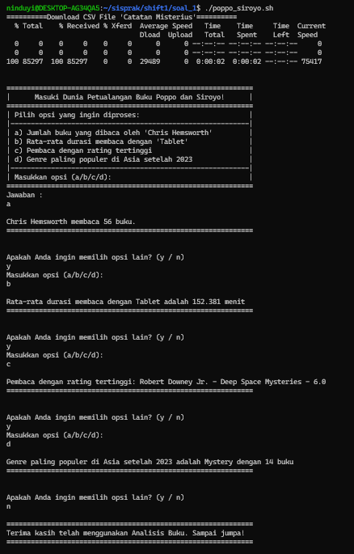


# Soal 2
_**Oleh : Nabilah Anindya Paramesti**_

## Deskripsi Soal
Anda merupakan seorang “Observer”, dari banyak dunia yang dibuat dari ingatan yang berbentuk “fragments” - yang berisi kemungkinan yang dapat terjadi di dunia lain. Namun, akhir-akhir ini terdapat anomali-anomali yang seharusnya tidak terjadi, perpindahan “fragments” di berbagai dunia, yang kemungkinan terjadi dikarenakan seorang “Seeker” yang berubah menjadi “Ascendant”, atau dalam kata lain, “God”. Tidak semua “Observer” menjadi “Player”, tetapi disini anda ditugaskan untuk ikut serta dalam menjaga equilibrium dari dunia-dunia yang terbuat dari “Arcaea”.

## Jawaban
### A. “First Step in a New World”
> Tugas pertama, dikarenakan kejadian “Axiom of The End” yang semakin mendekat, diperlukan sistem untuk mencatat “Player” aktif agar terpisah dari “Observer”. Buatlah dua shell script, **login.sh** dan **register.sh**, yang dimana database “Player” disimpan di **/data/player.csv** Untuk `register`, parameter yang dipakai yaitu **email, username, dan password**. Untuk `login`, parameter yang dipakai yaitu **email dan password**.

### Penyelesaian
#### Membuat shell script `register.sh`
```bash
#!/bin/bash

file_player="data/player.csv"

echo "Enter your email: "
read -r email
echo "Enter your username: "
read -r username
echo "Enter your password: "
read -rs pass

echo "$email,$username,$pass" >> "$file_player"
echo ""
echo "Registration successful! 🎉"
```

Di sini, program hanya meminta input untuk email, username, dan password. Setelah itu, data akan disimpan ke dalam file `data/player.csv` dengan command `echo "$email,$username,$pass" >> "$file_player"`.

#### Membuat shell script `login.sh`
```bash
#!/bin/bash

file_player="data/player.csv"

while true; do
    echo "Enter your email: "
    read -r email
    echo "Enter your password: "
    read -rs pass

    if grep -q "^$email,$pass" "$file_player"; then
        echo -e "\nLogin successful! 🎉\n"
        break
    else
        echo -e "\n❌ Incorrect email or password. Please try again."
    fi
done
```
Membuat sistem login yang bisa menerima input email dan password, kemudian **memeriksa apakah email dan password tersebut cocok dengan data** yang ada di file `data/player.csv`

### B. “Radiant Genesis”
> Sistem login/register untuk para "Player" tentunya memiliki constraint, yaitu validasi email dan password. 
**Email harus memiliki format yang benar dengan tanda @ dan titik**, sementara **password harus memiliki minimal 8 karakter, setidaknya satu huruf kecil, satu huruf besar, dan satu angka** untuk menjaga keamanan data di dunia “Arcaea”.
```
Constraint :
1. Email harus memiliki format yang benar dengan tanda @ dan titik
2. Password harus memiliki minimal 8 karakter, setidaknya satu huruf kecil, satu huruf besar, dan satu angka
```

### Penyelesaian
Pertama saya akan menambahkan command untuk **validasi email dan password** agar sesuai dengan constraint nomor 1

`register.sh`
```bash
while true; do
    echo "Enter your email: "
    read -r email

    if [[ "$email" =~ ^[a-zA-Z0-9._%+-]+@[a-zA-Z0-9.-]+\.[a-zA-Z]{2,}$ ]]; then
        if grep -q "^$email," "$file_player"; then
            echo "This email is already registered. Please use a different email. ❌"
        else
            break  
        fi
    else
        echo "Invalid email format. Please make sure the email contains '@' and '.'. ❌"
    fi
done

echo "Enter your username: "
read -r username

while true; do
    echo "Enter your password (min 8 characters, 1 uppercase letter, 1 lowercase letter, and 1 number):"
    read -rs pass

    if [[ ${#pass} -ge 8 && "$pass" == *[[:lower:]]* && "$pass" == *[[:upper:]]* && "$pass" == *[0-9]* ]]; then
        break
    else
        echo "Password does not meet the requirements. Please try again. ❌"
    fi
done
```

`login.sh`
```bash
    if [[ "$email" =~ ^[a-zA-Z0-9._%+-]+@[a-zA-Z0-9.-]+\.[a-zA-Z]{2,}$ ]]; then
        echo "Email is valid."
        break 
    else
        echo "Invalid email format. Please make sure the email contains '@' and '.'"
    fi

    if [[ ${#pass} -ge 8 && "$pass" == *[[:lower:]]* && "$pass" == *[[:upper:]]* && "$pass" == *[0-9]* ]]; then
        break
    else
        echo "Password does not meet the requirements. Please try again."
    fi
```
Keterangan :
- `if [[ "$email" =~ ^[a-zA-Z0-9._%+-]+@[a-zA-Z0-9.-]+\.[a-zA-Z]{2,}$ ]];` 

Validasi Email: memastikan email yang dimasukkan memiliki format yang benar (ada @ dan .).
- `if [[ ${#pass} -ge 8 && "$pass" == *[[:lower:]]* && "$pass" == *[[:upper:]]* && "$pass" == *[0-9]* ]];` 

Validasi Password: Memastikan password memiliki panjang minimal 8 karakter, mengandung setidaknya satu huruf kecil, satu huruf besar, dan satu angka.

### C. “Unceasing Spirit”
> Karena diperlukan pengecekan keaslian “Player” yang aktif, maka diperlukan sistem untuk pencegahan duplikasi “Player”. Jadikan sistem login/register tidak bisa memakai email yang sama (email = unique), tetapi tidak ada pengecekan tambahan untuk username.

### Penyelesaian
Kita perlu menambahkan command agar sesuai dengan constraint yaitu tidak bisa memakai email yang sama / unique

```bash
if grep -q "^$email," "$file_player"; then
    echo "This email is already registered. Please use a different email. ❌"
else
    break  
fi
```
`grep` untuk memeriksa apakah email yang dimasukkan sudah ada di dalam file `data/player.csv`

### D. “The Eternal Realm of Light”
> Password adalah kunci akses ke dunia Arcaea. Untuk menjaga keamanan "Player", password perlu disimpan dalam bentuk yang tidak mudah diakses. Gunakan algoritma hashing sha256sum yang memakai static salt (bebas).

### Penyelesaian
```bash
hashed_pass=$(echo -n "RAMADHAN/$pass/ceriaYH17" | sha256sum | awk '{print $1}')
```
Password yang dimasukkan akan di-hash menggunakan algoritma `sha256sum`. Sebelum itu, password digabungkan dengan **string salt statis** `RAMADHAN/ceriaYH17`


### E. “The Brutality of Glass”
> Setelah sukses login, "Player" perlu memiliki akses ke sistem pemantauan sumber daya. Sistem harus dapat melacak penggunaan CPU (dalam persentase) yang menjadi representasi “Core” di dunia “Arcaea”. Pastikan kalian juga bisa melacak “terminal” yang digunakan oleh “Player”, yaitu CPU Model dari device mereka. 
Lokasi shell script: ./scripts/core_monitor.sh

### Penyelesaian
```bash
#!/bin/bash

CPU_USAGE=$(top -bn1 | grep "Cpu(s)" | sed "s/.*, *\([0-9.]*\)%* id.*/\1/" | awk '{print 100 - $1}')
CPU_MODEL=$(lscpu | grep "Model name" | sed 's/Model name: *//')

echo "[$(date '+%Y-%m-%d %H:%M:%S')] - CPU Usage [$CPU_USAGE%] - CPU Model [$CPU_MODEL]" >> $(pwd)/logs/core.log
```
Keterangan :

### F. “In Grief and Great Delight”
> Selain CPU, “fragments” juga perlu dipantau untuk memastikan equilibrium dunia “Arcaea”. RAM menjadi representasi dari “fragments” di dunia “Arcaea”, yang dimana dipantau dalam persentase usage, dan juga penggunaan RAM sekarang. 

Lokasi shell script: `./scripts/frag_monitor.sh`

### Penyelesaian
```bash
#!/bin/bash

RAM_USAGE=$(free | grep Mem | awk '{print $3/$2 * 100.0}')
RAM_TOTAL=$(free -m | grep Mem | awk '{print $2}')
RAM_AVAILABLE=$(free -m | grep Mem | awk '{print $7}')
RAM_USED=$(free -m | grep Mem | awk '{print $3}')

echo "[$(date '+%Y-%m-%d %H:%M:%S')] - RAM Usage [$RAM_USAGE%] - Used [$RAM_USED MB] - Details [Total: $RAM_TOTAL MB, Available: $RAM_AVAILABLE MB]" >> $(pwd)/logs/fragment.log
```
Keterangan :

### G. “On Fate's Approach”
> Pemantauan yang teratur dan terjadwal sangat penting untuk mendeteksi anomali. Crontab manager (suatu menu) memungkinkan "Player" untuk mengatur jadwal pemantauan sistem. 

Hal yang harus ada di fungsionalitas menu:
- Add/Remove CPU [Core] Usage
- Add/Remove RAM [Fragment] Usage
- View Active Jobs

Lokasi shell script: `./scripts/manager.sh`

### Penyelesaian
```bash
#!/bin/bash

current_dir=$(pwd)

file_player="$current_dir/data/player.csv"
log_dir="$current_dir/logs"

while true; do
    clear

    echo "====================================================="
    echo "                  ARCAEA TERMINAL                    "
    echo "====================================================="
    echo " [1] Add CPU - Core Monitor to Crontab 🖥️          "
    echo " [2] Add RAM - Fragment Monitor to Crontab 💾      "
    echo " [3] Remove CPU - Core Monitor from Crontab ❌     "
    echo " [4] Remove RAM - Fragment Monitor from Crontab ❌ "
    echo " [5] View All Scheduled Monitoring Jobs 📅         "
    echo " [6] Exit ARCAEA Terminal 🚪                       "
    echo "====================================================="
    echo ""
    read -p "Please select an option [1-6]: " option

    case $option in
        1)
            if ! crontab -l | grep -q "$current_dir/scripts/core_monitor.sh"; then
                (crontab -l; echo "* * * * * /bin/bash $current_dir/scripts/core_monitor.sh >> $log_dir/core.log 2>&1") | crontab -
                echo "✅ CPU - Core Monitor successfully added to crontab!"
            else
                echo "⚠️ CPU - Core Monitor is already present in crontab."
            fi
            ;;
        2)
            if ! crontab -l | grep -q "$current_dir/scripts/frag_monitor.sh"; then
                (crontab -l; echo "* * * * * /bin/bash $current_dir/scripts/frag_monitor.sh >> $log_dir/fragment.log 2>&1") | crontab -
                echo "✅ RAM - Fragment Monitor successfully added to crontab!"
            else
                echo "⚠️ RAM - Fragment Monitor is already present in crontab."
            fi
            ;;
        3)
            crontab -l | grep -v "$current_dir/scripts/core_monitor.sh" | crontab -
            echo "✅ CPU - Core Monitor successfully removed from crontab!"
            ;;
        4)
            crontab -l | grep -v "$current_dir/scripts/frag_monitor.sh" | crontab -
            echo "✅ RAM - Fragment Monitor successfully removed from crontab!"
            ;;
        5)
            echo "📋 Current scheduled jobs in crontab:"
            crontab -l
            ;;
        6)
            echo "🚪 Exiting ARCAEA Terminal. See you next time!"
            exit 0
            ;;
        *)
            echo "❌ Invalid choice! Please select a valid option [1-6]."
            ;;
    esac

    echo ""
    read -p "Press Enter to continue... ⏳"
done

```
Keterangan :

### H. “The Disfigured Flow of Time”
> Karena tentunya script yang dimasukkan ke crontab tidak mengeluarkan output di terminal, buatlah 2 log file, core.log dan fragment.log di folder ./log/, yang dimana masing-masing terhubung ke program usage monitoring untuk usage tersebut. 

Format log:
- core.log
> `[YYYY-MM-DD HH:MM:SS] - Core Usage [$CPU%] - Terminal Model [$CPU_Model]`
- fragment.log
> `[YYYY-MM-DD HH:MM:SS] - Fragment Usage [$RAM%] - Fragment Count [$RAM MB] - Details [Total: $TOTAL MB, Available: $AVAILABLE MB]`

### Penyelesaian
**`core.log`**
```bash
if ! crontab -l | grep -q "$current_dir/scripts/core_monitor.sh"; then
                (crontab -l; echo "* * * * * /bin/bash $current_dir/scripts/core_monitor.sh >> $log_dir/core.log 2>&1") | crontab -
```
Pada scripts di `manager.sh` bagian yang itu merupakan perintah agar output dari `core_monitor.sh` akan disimpan di direktori `/logs/core.log`
**`fragment.log`**
```bash
if ! crontab -l | grep -q "$current_dir/scripts/frag_monitor.sh"; then
                (crontab -l; echo "* * * * * /bin/bash $current_dir/scripts/frag_monitor.sh >> $log_dir/fragment.log 2>&1") | crontab -
```
Pada scripts di `manager.sh` bagian yang itu merupakan perintah agar output dari `frag_monitor.sh` akan disimpan di direktori `/logs/fragment.log`

### I. “Irruption of New Color”
> Sistem harus memiliki antarmuka utama yang menggabungkan semua komponen. Ini akan menjadi titik masuk bagi "Player" untuk mengakses seluruh sistem. Buatlah shell script `terminal.sh`
User flow :
- Register
- Login
    - Crontab manager (add/rem core & fragment usage)
    - Exit
- Exit

### Penyelesaian
```bash
#!/bin/bash

show_main_menu() {
    clear
    echo "=============================================================="
    echo "               🌟  Welcome to ARCAEA TERMINAL 🌟              "
    echo "============================================================== "
    echo "  [1] Register New Account        📝                          "
    echo "  [2] Login to Existing Account  🔑                           "
    echo "  [3] Exit Arcaea Terminal       🚪                           "
    echo "=============================================================="
    echo ""
    read -p "Enter option [1-3]: " opsi_terminal
}

while true; do
    show_main_menu

    case $opsi_terminal in
        1)
            echo "📝 Registering a New Account..."
            ./register.sh
            read -p "✅Registration successful! Press Enter to continue..."
            ;;
        2)
            echo "🔑 Logging into Existing Account..."
            ./login.sh
            ;;
        3)
            echo "🚪 Exiting Arcaea Terminal. Goodbye!"
            exit 0
            ;;
        *)
            echo "❌ Invalid option. Please choose a valid option [1-3]."
            ;;
    esac
done
```
Keterangan :


## Dokumentasi
### `terminal.sh`
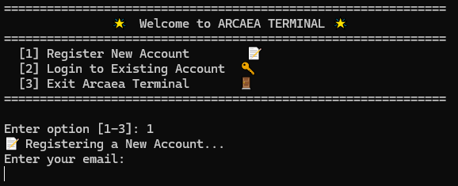

Ini merupakan tampilan ketika memilih opsi 1 (Register)

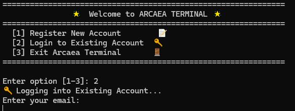

Ini merupakan tampilan ketika memilih opsi 2 (Login)


Ini merupakan tampilan ketika memilih opsi 3 (Exit)

### `register.sh`
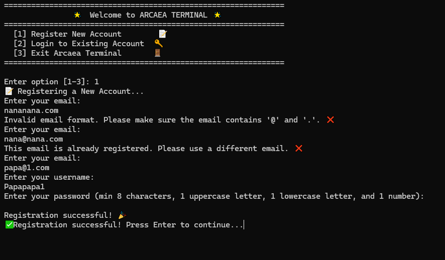

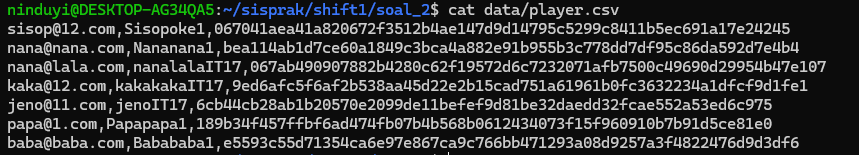

### `login.sh`
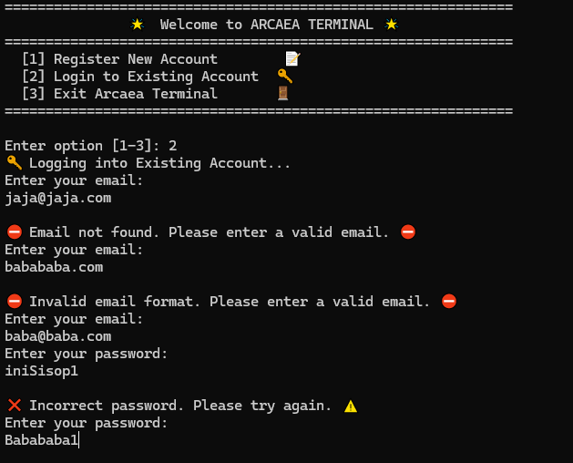

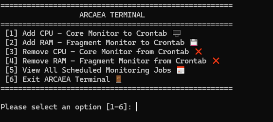

Ketika login telah berhasil, maka langsung di arahkan ke crontab menu

### `manager.sh`
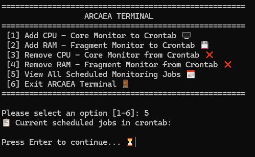

**Monitoring jobs awal** (memilih opsi 5)

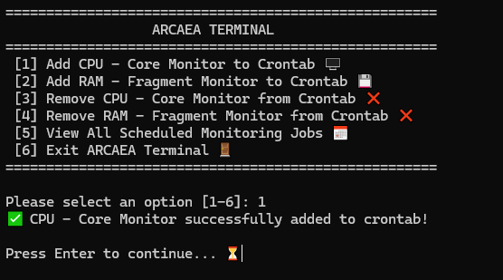

Memilih opsi 1 yaitu **add CPU**

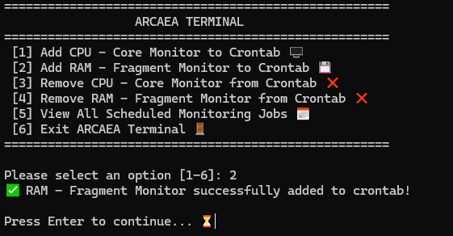

Memilih opsi 2 yaitu **add RAM**

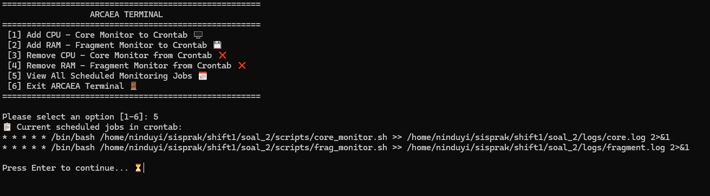

**Monitoring jobs setelah add CPU dan RAM** (memilih opsi 5)

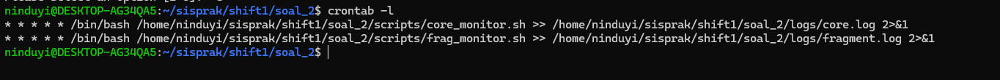

**Cek dengan `crontab -l`** di terminal

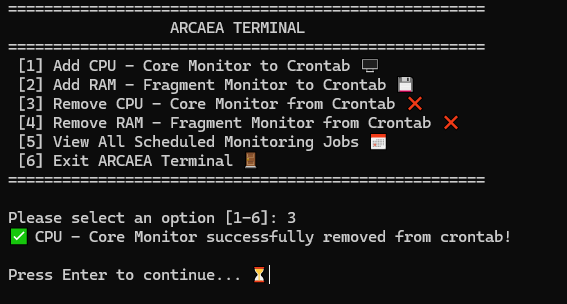

**Remove CPU** (memilih opsi 3)

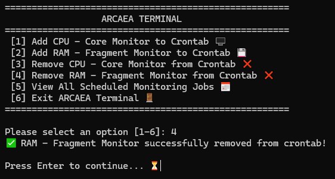

**Remove RAM** (memilih opsi 4)

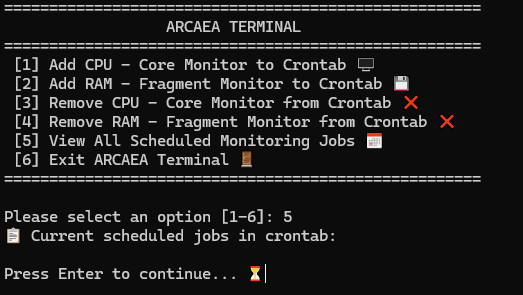

**Monitoring jobs setelah remove CPU dan RAM** (memilih opsi 5)

### `core_monitor.sh`
Ketika kita memilih opsi `add CPU` maka akan menjalankan `core_monitor.sh` dan outputnya akan disimpan di `core.log`
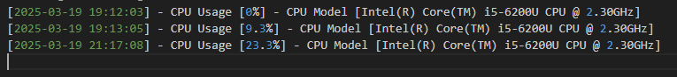
### `frag_monitor.sh`
Ketika kita memilih opsi `add RAM` maka akan menjalankan `frag_monitor.sh` dan outputnya akan disimpan di `fragment.log`
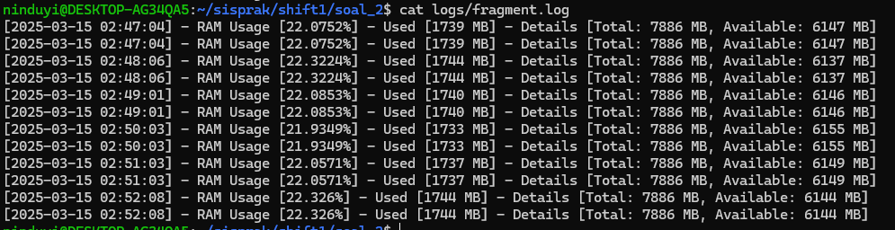


# Soal 3
_**Oleh : Muhammad Khairul Yahya**_

### Deskripsi Soal
Untuk merayakan ulang tahun ke 52 album The Dark Side of the Moon, tim PR Pink Floyd mengadakan sebuah lomba dimana peserta diminta untuk membuat sebuah script bertemakan setidaknya 5 dari 10 lagu dalam album tersebut. Sebagai salah satu peserta, kamu memutuskan untuk memilih Speak to Me, On the Run, Time, Money, dan Brain Damage. Saat program ini dijalankan, terminal harus dibersihkan terlebih dahulu agar tidak mengganggu tampilan dari fungsi fungsi yang kamu buat. Program ini dijalankan dengan cara ./dsotm.sh --play=”<Track>” dengan Track sebagai nama nama lagu yang kamu pilih.

### Penyelesaian

### Dokumentasi


# Soal 4
_**Oleh : Balqis Sani Sabillah**_
