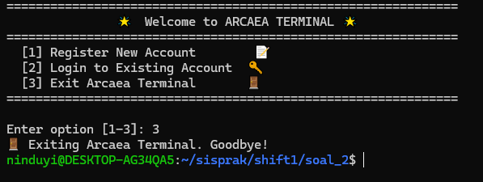

# Praktikum Sistem Operasi Modul 1 - IT17

## Anggota Kelompok

| NRP        | Nama                            |
|:----------:|:-------------------------------:|
| 5027241006 | Nabilah Anindya Paramesti       |
| 5027241092 | Muhammad Khairul Yahya          |
| 5027241002 | Balqis Sani Sabillah            |


## Daftar Isi

- [Soal 1](#soal-1)
- [Soal 2](#soal-2)
- [Soal 3](#soal-3)
- [Soal 4](#soal-4)

# Soal 1
_**Oleh : Nabilah Anindya Paramesti**_

## Deskripsi Soal
Di sebuah desa kecil yang dikelilingi bukit hijau, Poppo dan Siroyo, dua sahabat karib, sering duduk di bawah pohon tua sambil membayangkan petualangan besar. Poppo, yang ceria dan penuh semangat, baru menemukan kesenangan dalam dunia buku, sementara Siroyo, dengan otaknya yang tajam, suka menganalisis segala hal. Suatu hari, mereka menemukan tablet ajaib berisi catatan misterius bernama [reading_data.csv](https://drive.google.com/file/d/1l8fsj5LZLwXBlHaqhfJVjz_T0p7EJjqV/view?usp=sharing). Dengan bantuan keajaiban **awk**, mereka memutuskan untuk menjelajahi rahasia di balik data itu, siap menghadapi tantangan demi tantangan dalam petualangan baru mereka

> Note :
Seluruh command dimasukkan kedalam 1 file dan gunakan kondisi if else untuk setiap soalnya.

## Jawaban
### Soal Tipe A
> Poppo baru saja mulai melihat tablet ajaib dan terpukau dengan kekerenan orang bernama “Chris Hemsworth”. Poppo jadi sangat ingin tahu berapa banyak buku yang dibaca oleh “Chris Hemsworth”. Bantu Poppo menghitung jumlah baris di tablet ajaib yang menunjukkan buku-buku yang dibaca oleh Chris Hemsworth.

### Penyelesaian A
Untuk mengerjakan soal nomor 1, kita harus memiliki data 'reading_data.csv'. Disini saya menggunakan command `curl` untuk mendownload data tersebut.
```bash
echo "==========Download CSV File 'Catatan Misterius'=========="
curl -L -o reading_data.csv "https://drive.usercontent.google.com/u/0/uc?id=1l8fsj5LZLwXBlHaqhfJVjz_T0p7EJjqV&export=download"
```
Keterangan :
- `curl` = Perintah untuk mengunduh data dari internet.
- `-L`   = Menginstruksikan curl untuk mengikuti redirect jika URL mengarah ke lokasi lain jika ada.
- `-o reading_data.csv`= Menyimpan file yang diunduh dengan nama reading_data.csv di direktori saat ini.

Lalu diikuti dengan URL dari file CSV yang dibungkus dengan tanda `" "` (petik).

Setelah mendownload file tersebut kita baru mengerjakan perintah soal yaitu menghitung banyak buku yang dibaca oleh `Chris Hemsworth` dengan menggunakan command
```bash
count=$(awk -F',' '$2 == "Chris Hemsworth" {count++} END {print count}' reading_data.csv)
echo "Chris Hemsworth membaca $count buku."
```
Perintah ini menghitung berapa kali "Chris Hemsworth" muncul di kolom **kedua** file CSV lalu menyimpannya di variabel **count** dan menampilkan jumlahnya menggunakan command `echo`.

### Soal Tipe B
> Setelah menemukan tablet ajaib, Siroyo mulai penasaran dengan kebiasaan membaca yang tersimpan di dalamnya. Ia mulai menggunakan tablet ajaib dan bergumam sambil meneliti, “Aku ingin tahu berapa lama rata-rata mereka membaca dengan benda ini”. Bantu Siroyo untuk menghitung rata-rata durasi membaca (Reading_Duration_Minutes) untuk buku-buku yang dibaca menggunakan “Tablet”

### Penyelesaian B
Kita diminta untuk menghitung rata-rata durasi membaca (Reading_Duration_Minutes) untuk buku-buku yang dibaca menggunakan “Tablet”.
```bash
awk -F',' 'NR > 1 && $8 == "Tablet" {
        sum += $6;
        count++;
        }
        END {
            ave = sum / count;
            print "Rata-rata durasi membaca dengan Tablet adalah", ave, "menit";
        }' reading_data.csv
```
Keterangan :
- `awk -F',' 'NR > 1 && $8 == "Tablet"` = berarti memproses semua baris kecuali baris pertama (header) dan hanya memilih baris yang kolom kedelapan berisi "Tablet".
- `{sum += $6; count++}` = Menambahkan nilai kolom keenam (durasi membaca) ke variabel sum dan menghitung jumlah baris dengan count.
- `END {ave = sum / count; print "Rata-rata durasi membaca dengan Tablet adalah", ave, "menit"}` =  Setelah memproses semua baris, menghitung rata-rata dan menampilkan hasilnya.

### Soal Tipe C
> Sementara Siroyo sibuk menganalisis tablet ajaib, Poppo duduk disampingnya dengan ide cemerlang. “Kalau kita sudah tahu cara mereka membaca, aku ingin memberi hadiah ke temen yang paling suka sama bukunya!”. Ia pun mencari siapa yang memberikan rating tertinggi untuk buku yang dibaca (Rating) beserta nama (Name) dan judul bukunya (Book_Title).

### Penyelesaian C
Kita diminta mencari siapa yang memberikan rating tertinggi untuk buku yang dibaca (Rating) beserta nama (Name) dan judul bukunya (Book_Title).
```bash
awk -F, 'NR > 1 && ($7 > ratingMax) {
        ratingMax = $7; nama = $2; buku = $3
        } 
        END {
            print "Pembaca dengan rating tertinggi:", nama, "-", buku, "-", ratingMax
        }' reading_data.csv
```
Keterangan :
- `awk -F, 'NR > 1 && ($7 > ratingMax)` = memproses semua baris kecuali baris pertama (header) dan membandingkan nilai di kolom ketujuh dengan `ratingMax` untuk menemukan rating tertinggi.
- `{ratingMax = $7; nama = $2; buku = $3}` = Jika rating di kolom ketujuh lebih besar dari ratingMax, maka menyimpan nilai rating tersebut ke ratingMax, nama pembaca di kolom kedua ke variabel nama, dan buku di kolom ketiga ke variabel buku
- `END {print "Pembaca dengan rating tertinggi:", nama, "-", buku, "-", ratingMax}` = Setelah memproses semua baris, menampilkan pembaca dengan rating tertinggi beserta nama, buku yang dibaca, dan rating tertinggi.

### Soal Tipe D
> Siroyo mengusap keningnya dan berkata, "Petualangan kita belum selesai! Aku harus bikin laporan untuk klub buku besok." Ia ingin membuat laporan yang istimewa dengan tablet ajaib itu, fokus pada teman-teman di Asia. "Aku penasaran genre apa yang paling populer di sana setelah tahun 2023," katanya, membuka reading_data.csv sekali lagi. Bantu Siroyo menganalisis data untuk menemukan genre yang paling sering dibaca di Asia setelah 31 Desember 2023, beserta jumlahnya, agar laporannya jadi yang terbaik di klub.

### Penyelesaian D
Kita diminta menemukan genre yang paling sering dibaca di Asia setelah 31 Desember 2023 beserta jumlahnya.
```bash
awk -F, '$9 == "Asia" && $5 > "2023-12-31" {print $0}' reading_data.csv |       
        awk -F, '{print $4}' | sort | uniq -c |sort -nr |head -n 1 |   
        awk '{print "Genre paling populer di Asia setelah 2023 adalah "$2 " dengan " $1 " buku"}'
```
Keterangan :
- `awk -F, '$9 == "Asia" && $5 > "2023-12-31" {print $0}' reading_data.csv` = mencari baris demi baris di file `reading_data.csv`
    - `$9 == "Asia"` = Memilih baris yang kolom kesembilan berisi "Asia".
    - `$5 > "2023-12-31"` = Memilih baris yang kolom kelima (tanggal) lebih besar dari 31 Desember 2023.
    - `{print $0}` = Menampilkan seluruh baris yang memenuhi kondisi tersebut.
lalu di pipe (outputnya dijadikan input perintah selanjutnya)
- `awk -F, '{print $4}' | sort | uniq -c |sort -nr |head -n 1 `
    - `{print $4}`: Menampilkan kolom keempat (genre) dari hasil baris yang telah dipilih sebelumnya.
    - `sort` = Mengurutkan genre yang telah dipilih secara alfabetis.
    - `sort -nr` = Mengurutkan hasil berdasarkan jumlah kemunculan genre secara menurun (dari yang paling banyak).
    - `head -n 1` = Menampilkan genre dengan jumlah kemunculan terbanyak.
lalu di pipe lagi
- `awk '{print "Genre paling populer di Asia setelah 2023 adalah "$2 " dengan " $1 " buku"}'` = Mencetak genre paling populer beserta jumlah kemunculannya dalam kalimat yang sudah ditentukan, menggunakan kolom pertama (jumlah) dan kolom kedua (genre).

### Penyelesaian Keseluruhan
Untuk memenuhi syarat penggunaan kondisi `if else` pada setiap soal, kita dapat membuat pilihan opsi yang memungkinkan pengguna memilih jawaban yang ingin ditampilkan. Dengan menggunakan `if else`, kita dapat memeriksa kondisi tertentu dan menampilkan jawaban yang sesuai berdasarkan pilihan kita.

```bash
echo "============================================================="
echo "|      Masuki Dunia Petualangan Buku Poppo dan Siroyo!      |"
echo "============================================================="
echo "| Pilih opsi yang ingin diproses:                           |"
echo "|-----------------------------------------------------------|"
echo "| a) Jumlah buku yang dibaca oleh 'Chris Hemsworth'         |"
echo "| b) Rata-rata durasi membaca dengan 'Tablet'               |"
echo "| c) Pembaca dengan rating tertinggi                        |"
echo "| d) Genre paling populer di Asia setelah 2023              |"
echo "|-----------------------------------------------------------|"
echo "| Masukkan opsi (a/b/c/d):                                  |"
echo "============================================================="
echo "Jawaban :" 

read opsi
```
command `read` berfungsi untuk menyimpan input yang dimasukkan ke variabel `opsi`.

Lalu saya menggunakan **loop** dan juga kondisi **if else** untuk menampilkan jawaban yang sesuai
```bash
while true; do
    if [ "$opsi" == "a" ]; then
        # ------command untuk jawaban A------ #

    elif [ "$opsi" == "b" ]; then
        # ------command untuk jawaban B------ #

    elif [ "$opsi" == "c" ]; then
        # ------command untuk jawaban C------ #

    elif [ "$opsi" == "d" ]; then
        # ------command untuk jawaban D------ #

    else
        echo "          Pilihan tidak valid              "
        echo "==========================================="
        echo "Harap pilih a, b, c, atau d."
    fi

    echo ""
    echo "Apakah Anda ingin memilih opsi lain? (y / n)"
    read pilih_lagi
    
    if [ "$pilih_lagi" == "n" ]; then
        echo "Terima kasih telah menggunakan Analisis Buku. Sampai jumpa!"
        break
    fi

    if [ "$pilih_lagi" == "y" ]; then
        echo "Masukkan opsi (a/b/c/d):"
        read opsi
    fi

done
```
Keterangan :
- `while true; do` = awal dari sebuah loop, yang berarti perintah di dalamnya akan terus dijalankan hingga kondisi tertentu terpenuhi (ada **break**) untuk keluar dari loop.
- Kondisi `if`, `elif`, dan `else` `[ "$opsi" == "d" ]; then` = Memeriksa apakah variabel `opsi` bernilai "...". Jika benar, perintah untuk jawaban ... akan dijalankan.
- Untuk menanyakan pilihan lanjutan `echo "Apakah Anda ingin memilih opsi lain? (y / n)"`
    - `read pilih_lagi` = untuk membaca input pengguna.
    -   Jika input `n`= menampilkan pesan "Terima kasih telah menggunakan Analisis Buku. Sampai jumpa!" dan keluar dari loop menggunakan `break`.
    - Jika input `y` = meminta input untuk memilih opsi lagi dengan perintah `echo "Masukkan opsi (a/b/c/d):"` dan membaca input ke dalam variabel `opsi`.
- Jika memilih untuk melanjutkan (memilih `y` dan memasukkan `opsi a/b/c/d`), program kembali ke awal loop dan meminta input `opsi` baru

## Kendala
- Pada soal tipe C saya sempat bingung, jika command `NR > 1` tidak ada maka output nya tidak muncul. Tetapi setelah ditambahkan `NR > 1` output muncul. Hal tersebut karena baris pertama (Nama,Penerbit,Buku,Rating) akan diproses pertama kali. ratingMax diinisialisasi menjadi 0 dan nilai pada kolom ke-7 adalah "Rating", yang merupakan teks, bukan angka. Tanpa `NR > 1`, baris pertama diproses dan perbandingan antara teks dan angka akan menyebabkan hasil yang tidak diinginkan.

## Dokumentasi


# Soal 2
_**Oleh : Nabilah Anindya Paramesti**_

## Deskripsi Soal
Anda merupakan seorang “Observer”, dari banyak dunia yang dibuat dari ingatan yang berbentuk “fragments” - yang berisi kemungkinan yang dapat terjadi di dunia lain. Namun, akhir-akhir ini terdapat anomali-anomali yang seharusnya tidak terjadi, perpindahan “fragments” di berbagai dunia, yang kemungkinan terjadi dikarenakan seorang “Seeker” yang berubah menjadi “Ascendant”, atau dalam kata lain, “God”. Tidak semua “Observer” menjadi “Player”, tetapi disini anda ditugaskan untuk ikut serta dalam menjaga equilibrium dari dunia-dunia yang terbuat dari “Arcaea”.

## Jawaban
### A. “First Step in a New World”
> Tugas pertama, dikarenakan kejadian “Axiom of The End” yang semakin mendekat, diperlukan sistem untuk mencatat “Player” aktif agar terpisah dari “Observer”. Buatlah dua shell script, **login.sh** dan **register.sh**, yang dimana database “Player” disimpan di **/data/player.csv** Untuk `register`, parameter yang dipakai yaitu **email, username, dan password**. Untuk `login`, parameter yang dipakai yaitu **email dan password**.

### Penyelesaian A
#### Membuat shell script `register.sh`
```bash
#!/bin/bash

file_player="data/player.csv"

echo "Enter your email: "
read -r email
echo "Enter your username: "
read -r username
echo "Enter your password: "
read -rs pass

echo "$email,$username,$pass" >> "$file_player"
echo ""
echo "Registration successful! 🎉"
```

Di sini, program hanya meminta input untuk email, username, dan password. Setelah itu, data akan disimpan ke dalam file `data/player.csv` dengan command `echo "$email,$username,$pass" >> "$file_player"`.

#### Membuat shell script `login.sh`
```bash
#!/bin/bash

file_player="data/player.csv"

while true; do
    echo "Enter your email: "
    read -r email
    echo "Enter your password: "
    read -rs pass

    if grep -q "^$email,$pass" "$file_player"; then
        echo -e "\nLogin successful! 🎉\n"
        break
    else
        echo -e "\n❌ Incorrect email or password. Please try again."
    fi
done
```
Membuat sistem login yang bisa menerima input email dan password, kemudian **memeriksa apakah email dan password tersebut cocok dengan data** yang ada di file `data/player.csv`

### B. “Radiant Genesis”
> Sistem login/register untuk para "Player" tentunya memiliki constraint, yaitu validasi email dan password. 
**Email harus memiliki format yang benar dengan tanda @ dan titik**, sementara **password harus memiliki minimal 8 karakter, setidaknya satu huruf kecil, satu huruf besar, dan satu angka** untuk menjaga keamanan data di dunia “Arcaea”.
```
Constraint :
1. Email harus memiliki format yang benar dengan tanda @ dan titik
2. Password harus memiliki minimal 8 karakter, setidaknya satu huruf kecil, satu huruf besar, dan satu angka
```

### Penyelesaian B
Pertama saya akan menambahkan command untuk **validasi email dan password** agar sesuai dengan constraint nomor

`register.sh`
```bash
while true; do
    echo "Enter your email: "
    read -r email

    if [[ "$email" =~ ^[a-zA-Z0-9._%+-]+@[a-zA-Z0-9.-]+\.[a-zA-Z]{2,}$ ]]; then
    # .... code bagian C ....
    else
        echo "Invalid email format. Please make sure the email contains '@' and '.'. ❌"
    fi
done

echo "Enter your username: "
read -r username

while true; do
    echo "Enter your password (min 8 characters, 1 uppercase letter, 1 lowercase letter, and 1 number):"
    read -rs pass

    if [[ ${#pass} -ge 8 && "$pass" == *[[:lower:]]* && "$pass" == *[[:upper:]]* && "$pass" == *[0-9]* ]]; then
        break
    else
        echo "Password does not meet the requirements. Please try again. ❌"
    fi
done
```

`login.sh`
```bash
    if [[ "$email" =~ ^[a-zA-Z0-9._%+-]+@[a-zA-Z0-9.-]+\.[a-zA-Z]{2,}$ ]]; then
        echo "Email is valid."
        break 
    else
        echo "Invalid email format. Please make sure the email contains '@' and '.'"
    fi

    if [[ ${#pass} -ge 8 && "$pass" == *[[:lower:]]* && "$pass" == *[[:upper:]]* && "$pass" == *[0-9]* ]]; then
        break
    else
        echo "Password does not meet the requirements. Please try again."
    fi
```
Keterangan :
- `if [[ "$email" =~ ^[a-zA-Z0-9._%+-]+@[a-zA-Z0-9.-]+\.[a-zA-Z]{2,}$ ]];` 

Validasi Email: memastikan email yang dimasukkan memiliki format yang benar (ada @ dan .).
- `if [[ ${#pass} -ge 8 && "$pass" == *[[:lower:]]* && "$pass" == *[[:upper:]]* && "$pass" == *[0-9]* ]];` 

Validasi Password: Memastikan password memiliki panjang minimal 8 karakter, mengandung setidaknya satu huruf kecil, satu huruf besar, dan satu angka.

### C. “Unceasing Spirit”
> Karena diperlukan pengecekan keaslian “Player” yang aktif, maka diperlukan sistem untuk pencegahan duplikasi “Player”. Jadikan sistem login/register tidak bisa memakai email yang sama (email = unique), tetapi tidak ada pengecekan tambahan untuk username.

### Penyelesaian C
Kita perlu menambahkan command agar sesuai dengan constraint yaitu tidak bisa memakai email yang sama / unique

```bash
if grep -q "^$email," "$file_player"; then
    echo "This email is already registered. Please use a different email. ❌"
else
    break  
fi
```
`grep` untuk memeriksa apakah email yang dimasukkan sudah ada di dalam file `data/player.csv`

### D. “The Eternal Realm of Light”
> Password adalah kunci akses ke dunia Arcaea. Untuk menjaga keamanan "Player", password perlu disimpan dalam bentuk yang tidak mudah diakses. Gunakan algoritma hashing sha256sum yang memakai static salt (bebas).

### Penyelesaian D
```bash
hashed_pass=$(echo -n "RAMADHAN/$pass/ceriaYH17" | sha256sum | awk '{print $1}')
```
Password yang dimasukkan akan di-hash menggunakan algoritma `sha256sum`. Sebelum itu, password digabungkan dengan **string salt statis** `RAMADHAN/ceriaYH17`


### E. “The Brutality of Glass”
> Setelah sukses login, "Player" perlu memiliki akses ke sistem pemantauan sumber daya. Sistem harus dapat melacak penggunaan CPU (dalam persentase) yang menjadi representasi “Core” di dunia “Arcaea”. Pastikan kalian juga bisa melacak “terminal” yang digunakan oleh “Player”, yaitu CPU Model dari device mereka. 
Lokasi shell script: ./scripts/core_monitor.sh

### Penyelesaian E
```bash
#!/bin/bash

CPU_USAGE=$(top -bn1 | grep "Cpu(s)" | sed "s/.*, *\([0-9.]*\)%* id.*/\1/" | awk '{print 100 - $1}')
CPU_MODEL=$(lscpu | grep "Model name" | sed 's/Model name: *//')

CORE_LOG_PATH="$(dirname "$0")/../logs/core.log"
echo "[$(date '+%Y-%m-%d %H:%M:%S')] - CPU Usage [$CPU_USAGE%] - CPU Model [$CPU_MODEL]" >>"$CORE_LOG_PATH"
```
Keterangan :
- Command yang ada di dalam `CPU_USAGE` awalnya menampilkan informasi sumber daya, lalu di `grep` yang mengandung kata "Cpu(s)", lalu dari baris tersebut ditampilkan CPU usage yaitu `100 - idle CPU (kolom ke-8)`
- Pada `CPU_MODEL` command `lscpu`  menampilkan informasi tentang CPU, lalu di `grep` yang mengandung kata "Model name", kemudian menggunakan `sed` untuk menghapus teks Model name: yang ada di depan.

### F. “In Grief and Great Delight”
> Selain CPU, “fragments” juga perlu dipantau untuk memastikan equilibrium dunia “Arcaea”. RAM menjadi representasi dari “fragments” di dunia “Arcaea”, yang dimana dipantau dalam persentase usage, dan juga penggunaan RAM sekarang. 

Lokasi shell script: `./scripts/frag_monitor.sh`

### Penyelesaian F
```bash
#!/bin/bash

RAM_USAGE=$(free | grep Mem | awk '{print $3/$2 * 100.0}')
RAM_TOTAL=$(free -m | grep Mem | awk '{print $2}')
RAM_AVAILABLE=$(free -m | grep Mem | awk '{print $7}')
RAM_USED=$(free -m | grep Mem | awk '{print $3}')

echo "[$(date '+%Y-%m-%d %H:%M:%S')] - RAM Usage [$RAM_USAGE%] - Used [$RAM_USED MB] - Details [Total: $RAM_TOTAL MB, Available: $RAM_AVAILABLE MB]" >> $(pwd)/logs/fragment.log
```
Keterangan :
- Command `free` untuk menampilkan statistik memori yg sedang digunakan, `-m` digunakan untuk satuan megabyte (MB).
- `grep Mem` untuk memilih baris yang mengandung Mem
- `RAM_USAGE` = used (kolom 3) / total (kolom 2) * 100
- `RAM_TOTAL` = total (kolom 2)
- `RAM_AVAILABLE` = available (kolom 7)
- `RAM_USED` = used (kolom 3)

### G. “On Fate's Approach”
> Pemantauan yang teratur dan terjadwal sangat penting untuk mendeteksi anomali. Crontab manager (suatu menu) memungkinkan "Player" untuk mengatur jadwal pemantauan sistem. 

Hal yang harus ada di fungsionalitas menu:
- Add/Remove CPU [Core] Usage
- Add/Remove RAM [Fragment] Usage
- View Active Jobs

Lokasi shell script: `./scripts/manager.sh`

### Penyelesaian G
```bash
#!/bin/bash

current_dir=$(pwd)

file_player="$current_dir/data/player.csv"
log_dir="$current_dir/logs"

while true; do
    clear

    echo "====================================================="
    echo "                  ARCAEA TERMINAL                    "
    echo "====================================================="
    echo " [1] Add CPU - Core Monitor to Crontab 🖥️          "
    echo " [2] Add RAM - Fragment Monitor to Crontab 💾      "
    echo " [3] Remove CPU - Core Monitor from Crontab ❌     "
    echo " [4] Remove RAM - Fragment Monitor from Crontab ❌ "
    echo " [5] View All Scheduled Monitoring Jobs 📅         "
    echo " [6] Exit ARCAEA Terminal 🚪                       "
    echo "====================================================="
    echo ""
    read -p "Please select an option [1-6]: " option

    case $option in
        1)
            if ! crontab -l | grep -q "$current_dir/scripts/core_monitor.sh"; then
                (crontab -l; echo "* * * * * /bin/bash $current_dir/scripts/core_monitor.sh >> $log_dir/core.log 2>&1") | crontab -
                echo "✅ CPU - Core Monitor successfully added to crontab!"
            else
                echo "⚠️ CPU - Core Monitor is already present in crontab."
            fi
            ;;
        2)
            if ! crontab -l | grep -q "$current_dir/scripts/frag_monitor.sh"; then
                (crontab -l; echo "* * * * * /bin/bash $current_dir/scripts/frag_monitor.sh >> $log_dir/fragment.log 2>&1") | crontab -
                echo "✅ RAM - Fragment Monitor successfully added to crontab!"
            else
                echo "⚠️ RAM - Fragment Monitor is already present in crontab."
            fi
            ;;
        3)
            crontab -l | grep -v "$current_dir/scripts/core_monitor.sh" | crontab -
            echo "✅ CPU - Core Monitor successfully removed from crontab!"
            ;;
        4)
            crontab -l | grep -v "$current_dir/scripts/frag_monitor.sh" | crontab -
            echo "✅ RAM - Fragment Monitor successfully removed from crontab!"
            ;;
        5)
            echo "📋 Current scheduled jobs in crontab:"
            crontab -l
            ;;
        6)
            echo "🚪 Exiting ARCAEA Terminal. See you next time!"
            exit 0
            ;;
        *)
            echo "❌ Invalid choice! Please select a valid option [1-6]."
            ;;
    esac

    echo ""
    read -p "Press Enter to continue... ⏳"
done

```
Keterangan :

**Opsi 1** = Menambahkan CPU Monitor (core_monitor.sh) ke crontab
- `if ! crontab -l | grep -q "$current_dir/scripts/core_monitor.sh"; then`

cek apakah ada baris yang mengandung path ke core_monitor.sh di dalam crontab, tetapi tidak dicetak outputnya.
- `(crontab -l; echo "* * * * * /bin/bash $current_dir/scripts/core_monitor.sh >> $log_dir/core.log 2>&1") | crontab -`

Penjelasan :
1.  `crontab -l` = Menampilkan daftar cron yang ada.
2.  `echo "* * * * * /bin/bash $current_dir/scripts/core_monitor.sh >> $log_dir/core.log 2>&1"` = Menambahkan tugas (menjalankan script tiap menit, memastikan dan bisa menyimpan ke core.log, lalu dimasukkan ke daftar cron yg sudah diperbarui) ke crontab

**Opsi 2** = Menambahkan RAM Monitor ke Crontab
- Sama seperti yang CPU bedanya, ini RAM

**Opsi 3** = Menghapus CPU Monitor dari Crontab
- `crontab -l | grep -v "$current_dir/scripts/core_monitor.sh" | crontab -
crontab -l`

Penjelasan :
1. `crontab -l` = menampilkan daftar tugas
2. `grep -v "$current_dir/scripts/core_monitor.sh"` =  baris yang mengandung core_monitor.sh akan dihapus
3. `| crontab -` = Memasukkan kembali daftar cron yang telah diperbarui ke dalam crontab

**Opsi 4** =  Menghapus RAM Monitor dari Crontab
- Sama seperti yang CPU bedanya, ini RAM

**Opsi 5** = Melihat Semua Cron Job
- `crontab -l` = Menampilkan daftar cron jobs yang aktif

**Opsi 6** 
- `exit 0` akan keluar dari skrip dan mengakhiri program

### H. “The Disfigured Flow of Time”
> Karena tentunya script yang dimasukkan ke crontab tidak mengeluarkan output di terminal, buatlah 2 log file, core.log dan fragment.log di folder ./log/, yang dimana masing-masing terhubung ke program usage monitoring untuk usage tersebut. 

Format log:
- core.log
> `[YYYY-MM-DD HH:MM:SS] - Core Usage [$CPU%] - Terminal Model [$CPU_Model]`
- fragment.log
> `[YYYY-MM-DD HH:MM:SS] - Fragment Usage [$RAM%] - Fragment Count [$RAM MB] - Details [Total: $TOTAL MB, Available: $AVAILABLE MB]`

### Penyelesaian H
**`core.log`**
```bash
if ! crontab -l | grep -q "$current_dir/scripts/core_monitor.sh"; then
                (crontab -l; echo "* * * * * /bin/bash $current_dir/scripts/core_monitor.sh >> $log_dir/core.log 2>&1") | crontab -
```
Pada scripts di `manager.sh` bagian yang itu merupakan perintah agar output dari `core_monitor.sh` akan disimpan di direktori `/logs/core.log`
**`fragment.log`**
```bash
if ! crontab -l | grep -q "$current_dir/scripts/frag_monitor.sh"; then
                (crontab -l; echo "* * * * * /bin/bash $current_dir/scripts/frag_monitor.sh >> $log_dir/fragment.log 2>&1") | crontab -
```
Pada scripts di `manager.sh` bagian yang itu merupakan perintah agar output dari `frag_monitor.sh` akan disimpan di direktori `/logs/fragment.log`

### I. “Irruption of New Color”
> Sistem harus memiliki antarmuka utama yang menggabungkan semua komponen. Ini akan menjadi titik masuk bagi "Player" untuk mengakses seluruh sistem. Buatlah shell script `terminal.sh`
User flow :
- Register
- Login
    - Crontab manager (add/rem core & fragment usage)
    - Exit
- Exit

### Penyelesaian I
```bash
#!/bin/bash

while true; do
    clear
    echo "=============================================================="
    echo "               🌟  Welcome to ARCAEA TERMINAL 🌟              "
    echo "============================================================== "
    echo "  [1] Register New Account        📝                          "
    echo "  [2] Login to Existing Account  🔑                           "
    echo "  [3] Exit Arcaea Terminal       🚪                           "
    echo "=============================================================="
    echo ""
    read -p "Enter option [1-3]: " opsi_terminal

    case $opsi_terminal in
        1)
            echo "📝 Registering a New Account..."
            ./register.sh
            read -p "✅Registration successful! Press Enter to continue..."
            ;;
        2)
            echo "🔑 Logging into Existing Account..."
            ./login.sh
            ;;
        3)
            echo "🚪 Exiting Arcaea Terminal. Goodbye!"
            exit 0
            ;;
        *)
            echo "❌ Invalid option. Please choose a valid option [1-3]."
            ;;
    esac
done
```
Keterangan :
- `case $opsi_terminal in ... esac` = memeriksa yang dimasukkan oleh pengguna.

Berdasarkan opsi tersebut :

**Opsi 1**
- `./register.sh` menjalankan script `register.sh`
- `read -p` = menampilkan pesan dan menunggu input dari pengguna sebelum lanjut ke berikutnya

**Opsi 2**
- `./login.sh` menjalankan script `login.sh`

**Opsi 3**
- `exit 0` akan keluar dari skrip dan mengakhiri program

## Kendala
- Kendala yang dihadapi adalah setelah berhasil login, tidak langsung diarahkan ke menu crontab, melainkan tetap berada di menu awal. Solusinya adalah dengan menambahkan perintah untuk menjalankan `manager.sh` setelah login berhasil pada file `login.sh`.
- Penulisan path ke folder log yang awalnya diubah pada file `manager.sh`, namun tidak berhasil. Akhirnya, perubahan dapat dilakukan melalui perintah `crontab -e`
- pada `core_monitor.sh` penulisan path menuju `core.log` tidak benar, karena saya menggunakan `pwd` jika di run dari terminal.sh sampai ke tahap crontab menu, maka `pwd` berarti `/home/user`, akhirnya saya menggunakan `dirname "$0"/../logs/core.log` dimana `dirname "$0"` menunjukkan direktori scripts berada.

## Dokumentasi
### `terminal.sh`


Ini merupakan tampilan ketika memilih opsi 1 (Register)


Ini merupakan tampilan ketika memilih opsi 2 (Login)



Ini merupakan tampilan ketika memilih opsi 3 (Exit)

### `register.sh`


### `login.sh`


Ketika login telah berhasil, maka langsung di arahkan ke crontab menu

### `manager.sh`


**Monitoring jobs awal** (memilih opsi 5)


Memilih opsi 1 yaitu **add CPU**


Memilih opsi 2 yaitu **add RAM**


**Monitoring jobs setelah add CPU dan RAM** (memilih opsi 5)


**Cek dengan `crontab -l`** di terminal


**Remove CPU** (memilih opsi 3)


**Remove RAM** (memilih opsi 4)


**Monitoring jobs setelah remove CPU dan RAM** (memilih opsi 5)

### `core_monitor.sh`
Ketika kita memilih opsi `add CPU` maka akan menjalankan `core_monitor.sh` dan outputnya akan disimpan di `core.log`

### `frag_monitor.sh`
Ketika kita memilih opsi `add RAM` maka akan menjalankan `frag_monitor.sh` dan outputnya akan disimpan di `fragment.log`


# Soal 3
_**Oleh : Muhammad Khairul Yahya**_

## Deskripsi Soal
Untuk merayakan ulang tahun ke 52 album The Dark Side of the Moon, tim PR Pink Floyd mengadakan sebuah lomba dimana peserta diminta untuk membuat sebuah script bertemakan setidaknya 5 dari 10 lagu dalam album tersebut. Sebagai salah satu peserta, kamu memutuskan untuk memilih Speak to Me, On the Run, Time, Money, dan Brain Damage. Saat program ini dijalankan, terminal harus dibersihkan terlebih dahulu agar tidak mengganggu tampilan dari fungsi fungsi yang kamu buat. Program ini dijalankan dengan cara ./dsotm.sh --play=”<Track>” dengan Track sebagai nama nama lagu yang kamu pilih.

## Penyelesaian!!!!?
pertama-tama baca doa bismillah, lalu lakukan langkah-langkah berikut:

1. Wajib banget pake Shebang? 
shebang? emang apaan....
- `#!/bin/bash` : ini dia shebang. Dia ini buat kasitau ke sistem kalau skrip ini harus dijalankan menggunakan interpreter Bash/ skrip ini dijalankan di lingkungan shell Bash. Bahasa kasarnya ada kalau codenya ada gituan = skrip shell bash. ok sip gitu aja.

2.Karena ini fungsi nya membutuhkan banyak ruang, jadi....
```bash clear terminal(){
    clear 
} 
```
Apaan tuh? ini adalah fungsi simpel buat bersihin terminal dengan perintah `clear`. ini tuh kalau mau menjalankan/menampilkan sesuatu itu harus dibersihkan layar terminalnya. gituuuu.

## Jawaban 

### A. Speak to Me
> Lagu ini merupakan fitur yang memanggil API, tapi karena saya menggunakan kata kustom sehingga saya menggunakan array yang saya bikin sendiri sehingga saat user menginput namanya, maka kalimat itu akan menyesuaikan nama dari user itu. **Fitur ini menampilkan word of affirmation setiap detik.** HAH? GMN CARANYA?!??!?!

Pertama-tama kita akan membuat sebuah fitur yang akan membaca nama dari user, seperti ini:
```bash
speak to me(){
echo "Kimi no Nawa:" #dalam bahasa jepang, siapa namamu?
read -r name 
```
Keterangan:
- `echo "Kimi no Nawa:"` : Memunculkan kalimat "Kimi no Nawa:" di terminal. Sehingga user akan menginput nama mereka/orang lain, terserah mereka lah.
- `read -r name` : `read` di dalam bash berfungsi untuk membaca input dari user. `name` adalah variabel yang akan menyimpan input dari user. `-r. ok sip gitu aja.

Array dari kalimat affirmasinya gmn mas irul??
ini dia!

```bash
affirmations=(
    "$name adalah TOP LEADER!!."
    "ORA UMUM!!."
    "kamu adalah lebih dari apa yang kamu bayangkan!!."
    "just do it $name!!."
    "aku sayang kamu, $name."
    "$name look lonely, i can fix that."
    "jangan lupa makan ya $name."
    "semua ada progressnya."
    "GOOD JOB!!!."
    "IM A LION PIECE OF KITTEN."
    "YESSS KINGGG!!! $name ARE THE KING!!."
    "Kegagalan adalah keberhasilan yang tertunda kata mamah."
    "Kata ilham tirai no 2."
    "Jangan biarkan diri anda dibimbing oleh perasaan nafsu atau cinta."
    "Pikirkan diri anda dengan enteng dan pikirkan dunia secara mendalam."
    "Thou Art I, And I am Thou."
    "Setiap hari terbaik ada di Junes!"
    "walaupun tidak ada yang mencintai $name, masih ada aku di sisimu <3 ."
    "janganlah menjadi ambatukam, tapi jadilah hambatuhan."
    "dari maghrib kita bisa melihat bahwa di setiap kegelapan, pasti ada senja yang menyinari keindahan."
    "mulut bergetar jantung berdebar kukira jatuh cinta, ternyata lapar."
    "kita bisa memilihnya, tapi biarkan dia memilih pilihannya sendiri."
    "hey $name janganlah sedih, ingat masih banyak episode yang blm kamu lalui!."
    "jangan biarkan sisi badutmu menguasaimu, $name ."
    "capek aku wak, biarkan aku istirahat pls!!."
    "bang udah bang :< ."
    "kucing itu imut tapi lebih imut $name ."
    "Terkadang jawaban dari apa yang $name cari, ada di Tahu Sumedang."
    "Semoga affirmasiku ini membantu $name menjalani hari."
    "Sekasar-kasarnya yes king, tetapi ia memiliki cinta dan cahaya dalam hatinya."
    "Terbentur, Terbentur, Terbentuk."
    "Hidup dapat memberikan segala pada barang siapa tahu dan pandai menerima."
    "God bless this opportunity for me to find a voice for some words that have waited for way too long."
    "Imagination brings bliss at no cost, when I blink blink I receive at no loss."
    "Carpediem - The enjoyment of the pleasure of the moment without concern for the future."
    "Bor mu lah yang akan menembus surga!"
)
```

> Banyak banget yah.....totalnya kalau gk salah 36 kata. Kalau mau nambahin lagi tinggal dibikin dengan template array yang sesuai dibawah. Itulah mengapa saya memilih array sehingga bisa menambahkan atau mengurangi kalimat affirmasinya sesuai dengan kebutuhan.

Penjelasan: Ini adalah array yang berisi berbagai kaliamt afirmasi atau motivasi dari kak gem. Hah kak gem??! kenapa kak gem? .....tunggu itu kujelasin dibawah. Array ini berisi 36 kalimat afirmasi yang dapat membantu meningkatkan semangat. Oh ya! kalau kalian lihat, itu kan ada `$name` kan....ini adalah placeholder, yang akan diganti dengan nama yang dimasukkan user. 

Lanjutttt... 

```bash
while true; do
    random_index=$((RANDOM % ${#affirmations[@]}))
    personalized_affirmation=$(echo "${affirmations[$random_index]}" | sed "s/\$name/$name/g")
    echo -e "Kata Kak Gem: $personalized_affirmation"
    sleep 1
done
```
> WADUH RIBET BANGET?!??! INI APA MAS IRUL :<<<
Tenang-tenang...biar kujelasin

Penjelasan: ini adalah loop tak terbatas ~~seperti cintaku kepada dia~~  `while true: do`, yang akan terus menampilkan kalimat afirmasi secara acak. 
- `random _index=$((RANDOM % ${#affirmations[@]}))` : ini adalah cara untuk mendapatkan indeks acak dari array `affirmations`
- `personalized_affirmation=$(echo "${affirmations[$random_index]}" | sed "s/\$name/$name/g")` : mengganti placeholder `$name` dengan nama yang dimasukkan user.
- `echo -e` : ini tuh buat menampilkan kaliamt afirmasi setelah diganti jadi nama user. Nah disini ada `Kata Kak Gem: `, ini itu buat memunculkan kalimat afirmasi setelah kata kak gem.
- `sleep 1` : seperti namanya, nanti program itu akan "tidur" atau jeda selama 1 detik sebelum menampilkan kalimat berikutnya. Sesuai dengan kemauan soal

> Segitu aja untuk penyelesaian soal A, lanjut ke On the Run.......

### B. On the Run
>  lagu ini menugaskan kita untuk membuat sebuah progress bar yang berjalan dengan interval/durasi random (setiap progress bertambah kisaran 0.1-1 detik). **Soal ini menugaskan untuk membuat loading bar dengan progress bertambah kisaran 0.1-1 detik**

```bash
on_the_run() {
    total_steps=100
    echo "READY, SET, GO!"
    echo
```
> Ini berfungsi sebagai mensimulasikan progress bar dengan total 100 langkah. Terus nanti ada pesan READY, SET, GO! sebagai pembuka dari awal progress bar

```bash
for ((i=0; i<=total_steps; i++)); do
    sleep_interval=$(awk -v min=0.1 -v max=1 'BEGIN{srand(); print min+rand()*(max-min)}')
    sleep "$sleep_interval"
    percent=$((i * 100 / total_steps))
    filled=$(printf "%${i}s" | tr ' ' '=')
    empty=$(printf "%$((total_steps - i))s")
    printf "\r[%-${total_steps}s] %d%%" "$filled$empty" "$percent"
```
> jelasin dong mas irul..! **OKE!**

Penjelasan: Fungsi ini merupakan loop yang akan menampilkan progress bar dengan persentase(%) yang akan bertambah detik demi detik ~~bata demi bata~~ :

- `sleep_interval=$(awk -v min=0.1 -v max=1 'BEGIN{srand(); print min+rand()*(max-min)}')` : ini tuh bakalan menghasilkan waktu tidur/sleep yang acak kisaran 0,1 sampe 1 detik.
- `percent=$((i * 100 / total_steps))` : ini bakalan menghitung persentase dari progress bar yang sedang berjalan.
- `filled=$(printf "%${i}s" | tr ' ' '=')` : ini bakalan menghasilkan string yang diisi dengan '=' sebanyak $i kali. Lalu diikuti area kosong ' '
- `empty=$(printf "%$((total-steps - i))s")` : ini digunakan untuk menghasilkan variabel yang mengkosongkan progress bar yang belum diisi.
- `printf "\r[%-${total_steps}s] %d%%" "$filled$empty" "$percent"` : Inilah yang akan menampilkan progress bar beserta persentase (%) - nya.

```bash
case $percent in
    20) echo -e "\nCmon, this is the start of the journey!" ;;
    40) echo -e "\nAlmost halfway through!!" ;;
    50) echo -e "\nYES YOU MADE IT HALF, 50% MORE!!" ;;
    70) echo -e "\nALMOST there!!! keep up champ!" ;;
    80) echo -e "\nKEEP UP!! GO!! GO!! GO!!" ;;
    100) echo -e "\nANDDD...YOU DID IT CHAMP!!! YOU BECOME A RUNNER!" ;;
esac
```
> Ini adalah **Custom dari mas irul!!!**, gmn tuh???

Penjelasan: Pada persentase tertentu, pesan motivasi bakal ditampilkan sesuai dengan persentase yang disetting di skrip berikut. Menggunakan format `echo -e`. sedangkan `esac` itu buat mengakhiri struktur case. Begitu kawan-kawan.

### C. Time
> Soal ini menugaskan kita untuk **membuat live clock dengan fitur tampilan: tanggal, jam, menit, dan detik**

```bash
time_clock(){
    while true; do
        waktu_saiki=$(date +"%Y-%m-%d %H:%M:%S")
        printf "\r%s" "$waktu_saiki"
        sleep 1
    done
}
```
> singkat saja buat penyelesaian opsi C ini.....

Penjelasan: Fungsi disini akan menampilkan waktu right now which is dengan format `YYYY-MM-DD HH:MM:SS` dan nanti akan terus diperbarui setiap detik. Cool? yeah....tapi gk bisa dikustom karena error :< 

### D. Money
> menurutku ini soal tersusah sih, ribetttt banget. Jadi soal ini menugaskan kita untuk membuat program dengan efek serupa dengan **cmatrix**. tetapi diganti dengan isi **simbol mata uang**. Minimal 5 simbol.

```bash
echo -e "\e[32m" #warna ascii art cyan

echo " ███▄ ▄███▓ ▄▄▄     ▄▄▄█████▓ ██▀███   ██▓▒██   ██▒";
echo "▓██▒▀█▀ ██▒▒████▄   ▓  ██▒ ▓▒▓██ ▒ ██▒▓██▒▒▒ █ █ ▒░";
echo "▓██    ▓██░▒██  ▀█▄ ▒ ▓██░ ▒░▓██ ░▄█ ▒▒██▒░░  █   ░";
echo "▒██    ▒██ ░██▄▄▄▄██░ ▓██▓ ░ ▒██▀▀█▄  ░██░ ░ █ █ ▒ ";
echo "▒██▒   ░██▒ ▓█   ▓██▒ ▒██▒ ░ ░██▓ ▒██▒░██░▒██▒ ▒██▒";
echo "░ ▒░   ░  ░ ▒▒   ▓▒█░ ▒ ░░   ░ ▒▓ ░▒▓░░▓  ▒▒ ░ ░▓ ░";
echo "░  ░      ░  ▒   ▒▒ ░   ░      ░▒ ░ ▒░ ▒ ░░░   ░▒ ░";
echo "░      ░     ░   ▒    ░        ░░   ░  ▒ ░ ░    ░  ";
echo "       ░         ░  ░           ░      ░   ░    ░  ";
echo "                                                   ";
echo -e "\e[0m" #reset warna
```
> **Custom dari mas irul** buat hiasan aja

Penjelasan: ini ASCII art, saya menggunakan website ini untuk membuat ASCII ART (https://patorjk.com/software/taag/) . Lalu di `\e[32m` berfungsi untuk memunculkan warna green. (btw mohon maaf di catatan ada cyan karena sebelumnya saya menggunakan cyan tapi kayaknya lebih cocok pake warna hijau. Klarifikasi ini). Sama jangan lupa setiap kata/ascii art untuk memunculkan warna harus diakhiri dengan `\e[0m` di akhir line, ini berfungsi untuk mereset warna.

> **LANJUTTTTTTTT!!!!!!!!**

```bash
echo "Morpheus: Halo Neo! pilih pil merah atau pil biru?"
echo "1. Pil Merah"
echo "2. Pil Biru"
read -p "Pilihan Anda akan mempengaruhi keseluruhan hidup anda! (1/2): " choice
```

Penjelasan: skrip ini berfungsi untuk memunculkan pilihan antara pil merah/pil biru. (ini referensi dari film the matrix if you know, you know). Pilihan ini akan mempengaruhi warna animasi cmatrix yang ditampilkan.

```bash
if [[ "$choice" == "1" ]]; then
    warna1=$(tput setaf 1) #ini merah
    warna2=$(tput setaf 3) #ini oranye
elif [[ "$choice" == "2" ]]; then
    warna1=$(tput setaf 2) #ini hijau
    warna2=$(tput setaf 3) #ini emas/kuning
else
    echo "Ditanya pil merah/biru dijawab apa....kesalahan berpikir."
    exit 1
fi
```

Penjelasan: 
- `if [[ "$choice" == "1" ]]; then` : awal dari struktur percabangan if-elif-else dengan kondisi yang memeriksa apakah pilihan dari user satu/dua ~~garam/madu~~. Jika kondisi 1, nanti diubah warna animasinya jadi merah dan oranya. Sedangkan kondisi 2, annti diubah warna animasinya jadi hijau dan kuning.
- `else .....` : kondisi else ini jika user iseng tidak memilih pilihan antara pil merah/biru. maka nanti ada pesan `Ditanya pil merah/biru dijawab apa....kesalahan berpikir.`
- `fi` : penutup struktur if-elif-else. Nah ini itu mengakhiri dari blok cabang if-elif-else. begitu temen-temen

```bash
cols=$(tput cols)
lines=$(tput lines)
clear
```

Penjelasan: singkatnya `cols` = ngambil lebar ; `lines` = ngambil tinggi dari terminal. Lalu `clear` buat membersihkan terminal sebelum animasi dimulai, biar rapi.

```bash
simbol=('$' '€' '£' '¥' '¢' '₹' '₩' '₿' '₣' '₳' 'Rp')
delay=0.05
```
Penjelasan: 
- `simbol` : array yang berisi 11 simbol mata uang. AKU KAYA!
- `delay` : ngatur kecepatan animasi (detik). semakin kecil, semakin cepat animasinya.

> **nah...ini dia bagian skrip ribetnya** Semoga penjelasanku bisa dipahami ya teman-teman

```bash
while true; do
    for ((i = lines - 1; i > 0; i--)); do
        matrix[$i]="${matrix[$((i-1))]}"
    done
    row=""
    for ((j = 0; j < cols; j++)); do
        if (( RANDOM % 10 == 0 )); then
            random_index=$(( RANDOM % ${#simbol[@]} ))
            if (( RANDOM % 2 == 0)); then
                row+="${warna1}${simbol[$random_index]}${reset}"
            else
                row+="${warna2}${simbol[$random_index]}${reset}"
            fi
        else
            row+=" "
        fi
    done
    matrix[0]="$row"
    printf "\e[H"
    for ((i = 0; i < lines; i++)); do
        echo -n "${matrix[$i]}"
        printf "\n"
    done
    sleep "$delay"
done
```

Penjelasan, satu-satu ya:
1.
```bash
while true; do
    for ((i = lines - 1; i > 0; i--)); do
        matrix[$i]="${matrix[$((i-1))]}"
    done
```
Ini adalah loop yang menyimpan jumlah baris di terminal, `lines`. Lalu ini akan menggeser setiap baris dalam array `matrix[$i]` ke bawah, Baris ke-`i` diisi dengan nilai baris ke-`i-1`. Sehingga bisa **menciptakan animasi dimana simbol uang dari atas ke bawah.**

2. 
```bash
row=""
    for ((j = 0; j < cols; j++)); do
```
Ini adalah skrip yang berfungsi membuat garis baru, `row` berfungsi untuk menyimpan baris baru yang akan ditambahkan ke bagian atas animasi. lalu `cols` menyimpan jumlah kolom di terminal. Sehingga loop ini bisa mengisi setiap kolom dalam baris baru.

3.
```bash
        if (( RANDOM % 10 == 0 )); then
            random_index=$(( RANDOM % ${#simbol[@]} ))
            if (( RANDOM % 2 == 0)); then
                row+="${warna1}${simbol[$random_index]}${reset}"
            else
                row+="${warna2}${simbol[$random_index]}${reset}"
            fi
        else
            row+=" "
        fi
```
a. Kondisi `if (( RANDOM % 10 == 0 ))`:
- `RANDOM` : variabel bawaan bash yang menghasilkan angka acak.
- `RANDOM % 10 == 0` : ini berarti ada 10% menempatkan simbol mata uang di posisi tersebut
- `random_index=$(( RANDOM % ${#simbol[@]} ))` : ini berfungsi untuk memilih indeks acak dari array `simbol`, sedangkan `${#simbol[@]}` adalah jumlah elemen dalam array `simbol`

b. Kondisi `if (( RANDOM % 2 == 0))`:
- `RANDOM % 2 == 0` : simbol ini menggunakan warna pertama, `warna1`
- kalau tidak, maka menggunakan warna kedua, `warna2`
- Lalu simbol yang dpilih ditambahkan ke variabel `row` dengan warna yang sesuai.
- `reset` adalah kode yang mengembalikan warna teks ke default **seperti yang kusebut di ASCII ART money**

c. Kondisi `else`:
sama aja tapi dengan warna kedua, `warna2`

d. Kondisi `else`, tapi `row+=" "`:
jika kondisi `RANDOM % 10 == 0` tidak terpenuhi, spasi `" "` akan ditambahkan ke `row`.

e.``fi``: mengakhiri kondisi loop if-else sama kayak tadi..

4.
```bash
    matrix[0]="$row"
```

Penjelasan: baris baru `row` disimpan di indeks `0` array `matrix`. sehingga ini menjadi baris paling atas dalam animasi.

5.
```bash
    printf "\e[H"
    for ((i = 0; i < lines; i++)); do
        echo -n "${matrix[$i]}"
        printf "\n"
    done
```

Penjelasan:
- `printf "\e[H"` : ini saya menggunakakn kode ANSI untuk memindahkan kursor ke sudut kiri atas terminal `\e[H` . Ini memastikan animasi di posisi yang sama setiap kali, sehingga terlihat kayak animasi gerak-gerak.
- Kondisi `for ((i = 0; i < lines; i++))`: loop ini menambilkan setiap baris dalam array `matrix` ke layar. lalu `echo -n` menampilkan baris tanpa newline, sehingga baris berikutnya akan ditampilkan di bawahnya. Lalu diakhiri dengan `print "\n"`, yaitu menambahkan newline setelah setiap baris.

6.
```bash
    sleep "$delay"
done
```

Penjelasan: ini berfungsi untuk menjeda sebelum memperbarui animasi,
- `sleep "$delay"` : memberikan jeda sebelum animasi diperbarui.
- `delay` adalah variabel yg nyimpen waktu jeda (detik). seperti yg kujelasin di penjelasan simbol...
- Setelah jeda, loop akan kembali di awal dan memperbarui animasi.

> **nah ini dia endingnya, jadi gitu lah ya penjelasannya**. semoga penjelasanku bisa dipahami yaaah....

### E. Brain Damage
> soal ini menugaskan ita untuk **menampilkan proses yang sedang berjalan, seperti task manager tapi di terminal**. dan **menampilkan informasi data baru setiap detiknya.**

1. Tampilan Awal (ASCII ART):
```bash
clear
echo -e "\e[1;35m"
echo "      :::::::::  :::::::::      :::     ::::::::::: ::::    ::: :::::::::      :::     ::::    :::  ::::::::  :::::::::: "
echo "     :+:    :+: :+:    :+:   :+: :+:       :+:     :+:+:   :+: :+:    :+:   :+: :+:   :+:+:   :+: :+:    :+: :+:         "
echo "    +:+    +:+ +:+    +:+  +:+   +:+      +:+     :+:+:+  +:+ +:+    +:+  +:+   +:+  :+:+:+  +:+ +:+        +:+          "
echo "   +#++:++#+  +#++:++#:  +#++:++#++:     +#+     +#+ +:+ +#+ +#+    +:+ +#++:++#++: +#+ +:+ +#+ +#+        +#++:++#      "
echo "  +#+    +#+ +#+    +#+ +#+     +#+     +#+     +#+  +#+#+# +#+    +#+ +#+     +#+ +#+  +#+#+# +#+        +#+            "
echo " #+#    #+# #+#    #+# #+#     #+#     #+#     #+#   #+#+# #+#    #+# #+#     #+# #+#   #+#+# #+#    #+# #+#             "
echo "#########  ###    ### ###     ### ########### ###    #### #########  ###     ### ###    ####  ########  ##########       "
echo -e "\e[0m"
```

Penjelasan: nampilin ASCII art "brain damage" dengan warna magenta, cucok gitu `\e[1;35m`

2. Pesan Pembuka:
```bash
echo "Brain Damage: Task Manager di Terminal, katanya"
echo
```
Penjelasan: menampilkan pesan tentang fungsi nya ini buat apa? seperti yang disebutkan di skrip ini ya teman-teman....

3. Loop Utama:
```bash
while true; do
    tput cup 10 0
    waktu_ini=$(date +"%T")
    memory_info=$(free -m | awk 'NR==2 {printf "Memory used: %s/%s MB (%.2f%%)", $3, $2, ($3/$2)*100}')
    open_files=$(lsof | wc -l)
    bg_process=$(ps -e -o stat= | grep -c 'S')
    echo -e "\e[1;34mTime Current: $waktu_ini\e[0m"
    echo -e "\e[1;34m$memory_info\e[0m"
    echo -e "\e[1;34mFile Opened: $open_files\e[0m"
    echo -e "\e[1;34mBackground Processes: $bg_process\e[0m"
    echo
```
Penjelasan:
- `t put cup 10 0`: memindahkan kursor ke baris(10), kolom(0) untuk menampilkan informasi sistem.
- `waktu_ini` : inisial untuk menampilkan waktu dalam foramt `HH:MM:SS` `jam:menit:detik`.
- `memory_info` : menampilkan informasi penggunaan memory (total dan persentase). ini menggunakan format MB sesuai dengan perintah `free -m` (RAM MB).
- `open_files` : menghitung jumlah file yang sedang dibuka oleh proses. `lsof`, perintah ini menampilkan daftar file yang sedang dibuka oleh proses di sistem
- `bg_process` : menghitung jumlah proses yang berjalan di Latar Belakang. `ps -e -o stat= ` berfungsi untuk menampilkan informasi tentang semua proses yang sedang berjalan dengan format output hanya untuk menampilkan kolom **status proses**. `grep -c "S"`, diguankan untuk mencari pola untuk menghitung jumalh baris yang cocok dengan pola "S" ---> Sleeping, proses yang sedang menunggu/berjalan di latar belakang.

4. Daftar Proses yang menggunakan CPU Tertinggi:
```bash
echo -e "\e[1;36mPID\tUSER\tCPU%\tMEM%\tTIME+\tCOMMAND\e[0m"
ps aux --sort=-%cpu | awk 'NR<=11 {
    pid_color="\033[1;31m"
    user_color="\033[1;32m"
    cpu_color="\033[1;33m"
    mem_color="\033[1;34m"
    time_color="\033[1;35m"
    reset_color="\033[0m"
    printf "%s%-6s%s\t%s%-8s%s\t%s%-6s%s\t%s%-6s%s\t%s%-8s%s\t%s\n",
    pid_color, $2, reset_color,
    user_color, $1, reset_color,
    cpu_color, $3, reset_color,
    mem_color, $4, reset_color,
    time_color, $10, reset_color,
    $11
}'
```
Penjelasan:
a. `ps` : menampilkan informasi tentang proses yang sedang berjalan.
b. `aux` : **a** = nampilin proses dari semua pengguna; **u** = menampilkan informasi dalam format ramah pengguna (USER, CPU%, MEM%, dll).; **x** = menampilkan proses yang tidak terkait dengan terminal.
c. `--sort=-%cpu` : opsi ini mengurutkan outptu berdasarkan kolom `%CPU` secara descending (tinggi ke rendah)
d. `awk` : alat pemrosesan teks yang kuat.
e. `NR<=11`: artinya awk hanay memproses 11 baris pertama dari output `ps aux`.
f.
```bash
    pid_color="\033[1;31m" #merah bold
    user_color="\033[1;32m" #hijau bold
    cpu_color="\033[1;33m" #kuning bold
    mem_color="\033[1;34m" #biru bold
    time_color="\033[1;35m" #magenta bold
    reset_color="\033[0m" #reset warna ke default
```
Penjelasan: mengatur warna untuk setiap kolom. diatur semuanya dengan warna bold.
g.
```bash
    printf "%s%-6s%s\t%s%-8s%s\t%s%-6s%s\t%s%-6s%s\t%s%-8s%s\t%s\n",
    pid_color, $2, reset_color,
    user_color, $1, reset_color,
    cpu_color, $3, reset_color,
    mem_color, $4, reset_color,
    time_color, $10, reset_color,
    $11
```
Penjelasan:
- `%s` : nampilin string
- `%-6s` : nampilin string dengan lebar 6 karakter, rata kiri. bukan "kiri" yang itu
- `%-8s` : nampilin string dengan lebar 8 karakter, rata kiri.
- `\t` : tab misahin kolom
- `\n` : newline, mindahin ke baris berikutnya
- `$[nomor]` : kolom ke-nomor dari output `ps aux` sesuai dengan kolom-kolomnya

> **Kolom 1 (PID), 2 (USER), 3(CPU%), 4(MEM%), 5(TIME+), 6(COMMAND)**

5. Ada pesan tambahan, karena ada [error] gitu:
```bash
echo -e "\n\e[1;33mMaafkan saya karena CPU%-nya malah kegeser, tapi berfungsilah ya ps auxnya :)\e[0m"
tput ed
sleep 1
done
```
Penjelasan: pesan yang ngejelasin ada error di output lalu diakhiri dengan `tput ed`, menghapus teks dari posisi kursor saat ini hingga akhir layar. lalu nanti jeda 1 detik `sleep 1` untuk memperbarui informasi setiap detiknya.

### BONUS!!!!
> apa lagi ini mas irul....mas irul
Intinya, ini adalah ASCII dari cover album pink floyd:
```bash
eclipse(){
echo -e "\e[31m                                      '\$&\e[0m"
    echo -e "\e[32m                                      @R\$k\e[0m"
    echo -e "\e[33m                                    '\$!!!M&\e[0m"
    echo -e "\e[34m                                    @?~~~!\$k\e[0m"
    echo -e "\e[35m                                  '9!!~ ~~!MX\e[0m"
    echo -e "\e[36m                                  @X~~   \`~!\$k\e[0m"
    echo -e "\e[91m                                 9!!      ~~!\$X\e[0m"
    echo -e "\e[92m                                dR!~       \`~!\$>\e[0m"
    echo -e "\e[93m                               XR!~         \`~!\$k:\e[0m"
    echo -e "\e[94m                              tR!~        ::~~!!MMXXHHHH!!<:.\e[0m"
    echo -e "\e[95m                             <\$!xxiXX!!!~~~~~~~!!MMMMMMMMMMMMMMMXXXXx::\e[0m"
    echo -e "\e[96m                        .:X@N\$\$\$RMMX!!!!~~~~~~~~!!MMMM@@MMMMMMMMMMMMXMSMMtHHHX!\e[0m"
    echo -e "\e[31m                  :xiM#\"~  <\$!~  \`~~~!~~~~~~~~~~~!!MX!!!!!??#RR888MMMMMMMMMMMHH\e[0m"
    echo -e "\e[32m           ..XH@!~\`       X\$!~                 '~~~!MX!!!!!!!!!!!!?MMR@@\$MMMMMM\e[0m"
    echo -e "\e[33m     :xiM#\"~             <\$!~                     '~!MM??MMX!!!!!!!!!!!!!!??#R\$\e[0m"
    echo -e "\e[34mXH@M!\`\`                 :\$!!                        ~!R:   \`~!MM!XH!!!!!!!!!!!!\e[0m"
    echo -e "\e[35m                       <\$!~                         \`!!M:        \`~\"??HHX!!!!!!\e[0m"
    echo -e "\e[36m                      :\$!~                           \`!!R:              \`!!MMMH\e[0m"
    echo -e "\e[91m                     '\$!~                             \`~!8:                   ~\e[0m"
    echo -e "\e[92m                    :\$!!                               ~!!N:\e[0m"
    echo -e "\e[93m                   '\$!~                                 \`!!N:\e[0m"
    echo -e "\e[94m                  .\$!!~                                  ~~!&>\e[0m"
    echo -e "\e[95m                 '@!!~                                    ~!MN\e[0m"
    echo -e "\e[96m                .\$!!~                                     ~~!M&>\e[0m"
    echo -e "\e[31m               :@\$MHHHHHHHHH!!!!!!!!!!!!!!!!!!!!!!!!!!!!!!!!!H\$N\e[0m"

#fungsi untuk menambahkan warna
colorize() {
    local color_code=$1
    local text=$2
    echo -e "\e[${color_code}m${text}\e[0m"
}

# Warna ANSI
RED="31"
GREEN="32"
YELLOW="33"
BLUE="34"
MAGENTA="35"
CYAN="36"
WHITE="37"

# Menampilkan teks ASCII dengan warna
echo "                                                                                      "
colorize $RED "     ##                              /                                ##              "
colorize $GREEN "      ##                           #/                      #           ##             "
colorize $YELLOW "      ##                           ##                     ###          ##             "
colorize $BLUE "      ##                           ##                      #           ##             "
colorize $MAGENTA "      ##                           ##                                  ##             "
colorize $CYAN "  ### ##      /###    ###  /###    ##  /##       /###    ###       ### ##      /##    "
colorize $RED " #########   / ###  /  ###/ #### / ## / ###     / #### /  ###     #########   / ###   "
colorize $GREEN "##   ####   /   ###/    ##   ###/  ##/   /     ##  ###/    ##    ##   ####   /   ###  "
colorize $YELLOW "##    ##   ##    ##     ##         ##   /     ####         ##    ##    ##   ##    ### "
colorize $BLUE "##    ##   ##    ##     ##         ##  /        ###        ##    ##    ##   ########  "
colorize $MAGENTA "##    ##   ##    ##     ##         ## ##          ###      ##    ##    ##   #######   "
colorize $CYAN "##    ##   ##    ##     ##         ######           ###    ##    ##    ##   ##        "
colorize $RED "##    /#   ##    /#     ##         ##  ###     /###  ##    ##    ##    /#   ####    / "
colorize $GREEN " ####/      ####/ ##    ###        ##   ### / / #### /     ### /  ####/      ######/  "
colorize $YELLOW "  ###        ###   ##    ###        ##   ##/     ###/       ##/    ###        #####   "
colorize $BLUE "              /##                                                                     "
colorize $MAGENTA "            #/ ###                                                                    "
colorize $CYAN "           ##   ###                                                                   "
colorize $RED "           ##                                                                         "
colorize $GREEN "           ##                                                                         "
colorize $YELLOW "   /###    ######                                                                     "
colorize $BLUE "  / ###  / #####                                                                      "
colorize $MAGENTA " /   ###/  ##                                                                         "
colorize $CYAN "##    ##   ##                                                                         "
colorize $RED "##    ##   ##                                                                         "
colorize $GREEN "##    ##   ##                                                                         "
colorize $YELLOW "##    ##   ##                                                                         "
colorize $BLUE " ######    ##                                                                         "
colorize $MAGENTA "  ####      ##                                                                        "
colorize $CYAN "            /                                                                         "
colorize $RED "          #/                                                                          "
colorize $GREEN "    #     ##                                                                          "
colorize $YELLOW "   ##     ##                                                                          "
colorize $BLUE "   ##     ##                                                                          "
colorize $MAGENTA " ######## ##  /##      /##                                                            "
colorize $CYAN "########  ## / ###    / ###                                                           "
colorize $RED "   ##     ##/   ###  /   ###                                                          "
colorize $GREEN "   ##     ##     ## ##    ###                                                         "
colorize $YELLOW "   ##     ##     ## ########                                                          "
colorize $BLUE "   ##     ##     ## #######                                                           "
colorize $MAGENTA "   ##     ##     ## ##                                                                "
colorize $CYAN "   ##     ##     ## ####    /                                                         "
colorize $RED "   ##     ##     ##  ######/                                                          "
colorize $GREEN "    ##     ##    ##   #####                                                           "
colorize $YELLOW "                 /                                                                    "
colorize $BLUE "### /### /###   /   /###       /###    ###  /###                                      "
colorize $MAGENTA " ##/ ###/ /##  /   / ###  /   / ###  /  ###/ #### /                                   "
colorize $CYAN "  ##  ###/ ###/   /   ###/   /   ###/    ##   ###/                                    "
colorize $RED "  ##   ##   ##   ##    ##   ##    ##     ##    ##                                     "
colorize $GREEN "  ##   ##   ##   ##    ##   ##    ##     ##    ##                                     "
colorize $YELLOW "  ##   ##   ##   ##    ##   ##    ##     ##    ##                                     "
colorize $BLUE "  ##   ##   ##   ##    ##   ##    ##     ##    ##                                     "
colorize $MAGENTA "  ##   ##   ##   ##    ##   ##    ##     ##    ##                                     "
colorize $CYAN "  ###  ###  ###   ######     ######      ###   ###                                    "
colorize $RED "   ###  ###  ###   ####       ####        ###   ###                                   "
echo "                                                                                      "
echo "                                                                                      "
echo "                                                                                      "
echo "                                                                                      "

}
```
Penjelasan: ya ini ASCII art yang nampilin cover album sama teks `darkside of the moon`. ok sip gitu aja...

### last but not least, FUNGSI MAINNN!!!
> yeyyy!!!!!!! tepuk tangan!!!

**Fungsi Main**
```bash
main(){
    clear_terminal
    case $1 in 
    --play=Speak\ to\ Me)
    speak_to_me
    ;;
    --play=On\ the\ Run)
    on_the_run
    ;;
    --play=Time)
    time_clock
    ;;
    --play=Money)
    money_that
    ;;
    --play=Brain\ Damage)
    brain_dance
    ;;
    --play=Eclipse)
    eclipse
    ;;
    *)
    echo "Usage: ./dsotm.sh --play=<Track>"
    echo "Available Tracks: Speak to Me, On the Run, Time, Money, Brain Damage, Eclipse"
    ;;
    esac
}
```
Penjelasan:
a. `case $1` ini berisi tentang beberapa pilihan `<Track>` yang jika dipanggil maka akan memanggil fungsi dari masing-masing `<Track>`.
b.
```bash
 *)
    echo "Usage: ./dsotm.sh --play=<Track>"
    echo "Available Tracks: Speak to Me, On the Run, Time, Money, Brain Damage, Eclipse"
    ;;
```
Ini adalah pilihan default jika user mengetik `./dsotm.sh --play=<Track>`. Lalu `*)` adalah blok default yang akan dieksekusi jika argumen yg diberikan tidak cocok dengan pilihan yang ada. Lalu `Available Tracks: ...` menampilkan daftar fungsi yang tersedia.
c. `;;` menandakan akhir dari blok `case` untuk pilihan default
d. `esac` penutup dari struktur `case`, menandakan akhir dari blok percabangan.

Penutup:
`main "$@"` : perintah memanggil fungsi `main` adengan meneruskan semua argumen yang diberikan saat skrip dijalankan.

## Kendala
> Sebenarnya ada beberapa, kebanyakan pas menggarap fungsi money

1. Saat menjalankan fungsi money, terminal saya tidak mendukung efek `cmatrix` sehingga saya terpaksa untuk mengupdate WSL Ubuntu saya, yang dimana WSL yang saya gunakan.

2. Karena saya mengupdate WSL otomatis tidak bisa save dari file-file di WSL Ubuntu. Sehingga setiap ada perubahan dalam skrip, saya harus `rm -f dsotm.sh && cp /mnt/c/Users/Arul/Documents/bash_script/dsotm.sh /home/irul/bash_script/`

3. Saat menjalankan fungsi brain damage. Output untuk CPU% tergeser sehingga column dari CPU% kosong dan tergeser di baris berikutnya. Ini mempengaruhi kerapian dari output itu sendiri. Sudah saya coba untuk merapikan format printf akan tetapi masih sama.

> **SEKIAN TERIMA KASIH....**

## Dokumentasi
> rul yapping mulu, hasilnya mana!!??!
Ini buktinya guys!!!

## Output Default:


## Output Speak to Me:
.png)

## Output On the Run:


## Output Time (update per detik):


## Output Money:

### Menu:


### Pil Merah:


### Pil Biru:


### Kalau gk keduanya:

> for those who troll

## Output Brain Damage:


## Output Bonus (Eclipse):


# REVISI Soal 3

## Bagian yang di revisi

### A. Speak to Me

**Before revisi:**
```bash
affirmations=(
    "$name adalah TOP LEADER!!."
    "ORA UMUM!!."
    "kamu adalah lebih dari apa yang kamu bayangkan!!."
    "just do it $name!!."
    "aku sayang kamu, $name."
    "$name look lonely, i can fix that."
    "jangan lupa makan ya $name."
    "semua ada progressnya."
    "GOOD JOB!!!."
    "IM A LION PIECE OF KITTEN."
    "YESSS KINGGG!!! $name ARE THE KING!!."
    "Kegagalan adalah keberhasilan yang tertunda kata mamah."
    "Kata ilham tirai no 2."
    "Jangan biarkan diri anda dibimbing oleh perasaan nafsu atau cinta."
    "Pikirkan diri anda dengan enteng dan pikirkan dunia secara mendalam."
    "Thou Art I, And I am Thou."
    "Setiap hari terbaik ada di Junes!"
    "walaupun tidak ada yang mencintai $name, masih ada aku di sisimu <3 ."
    "janganlah menjadi ambatukam, tapi jadilah hambatuhan."
    "dari maghrib kita bisa melihat bahwa di setiap kegelapan, pasti ada senja yang menyinari keindahan."
    "mulut bergetar jantung berdebar kukira jatuh cinta, ternyata lapar."
    "kita bisa memilihnya, tapi biarkan dia memilih pilihannya sendiri."
    "hey $name janganlah sedih, ingat masih banyak episode yang blm kamu lalui!."
    "jangan biarkan sisi badutmu menguasaimu, $name ."
    "capek aku wak, biarkan aku istirahat pls!!."
    "bang udah bang :< ."
    "kucing itu imut tapi lebih imut $name ."
    "Terkadang jawaban dari apa yang $name cari, ada di Tahu Sumedang."
    "Semoga affirmasiku ini membantu $name menjalani hari."
    "Sekasar-kasarnya yes king, tetapi ia memiliki cinta dan cahaya dalam hatinya."
    "Terbentur, Terbentur, Terbentuk."
    "Hidup dapat memberikan segala pada barang siapa tahu dan pandai menerima."
    "God bless this opportunity for me to find a voice for some words that have waited for way too long."
    "Imagination brings bliss at no cost, when I blink blink I receive at no loss."
    "Carpediem - The enjoyment of the pleasure of the moment without concern for the future."
    "Bor mu lah yang akan menembus surga!"
)
```
Penjelasan: di soal nomor 1. diharuskan praktikan untuk membuat fungsi `speak to me()` menggunakan link API dari (https://github.com/annthurium/affirmations). Sehingga skrip ini tidak diperbolehkan menggunakan array.


**After Revisi:**
```bash
speak_to_me(){
    while true; do
        # Ambil kata-kata motivasi dari API, ekstrak menggunakan regex
        affirmation=$(curl -s -H "Accept: application/json" "https://www.affirmations.dev" | sed -E 's/.*"affirmation":"([^"]*)".*/\1/')
        
        # Munculkan kata-kata kak gem
        echo -n "Kata kak gem: "

        # Tampilkan kata per kata dengan efek seperti mengetik
        for word in $affirmation; do
            echo -n "$word " # Print kata per kata
            sleep 0.1
        done

        # Jeda antar kalimat
        echo ""
        sleep 1
    done
}
```
Perubahan serta penjelasan: ini adalah hasil revisi untuk fungsi speak_to_me menggunakan link API, yang diubah disini adalah
- `tidak ada kata afirmasi dengan $name dikarenakan kata afirmasi dari link github`
- `ada efek ketikan selama 0.1 detik`

Lalu untuk kode setelah direvisi ada dibagian:

`affirmation=$(curl -s -H "Accept: application/json" "https://www.affirmations.dev" | sed -E 's/.*"affirmation":"([^"]*)".*/\1/')`

Penjelasan:
- `curl -s -H "Accept: application/json" "https://www.affirmations.dev"` : mengambil data JSON dari API `affirmations.dev` secara diam-diam `-s`.
- `sed -E 's/.*"affirmation":"([^"]*)".*/\1/'` : menggunakan `sed` untuk mengekstrak teks yang ada di dalam kunci `"affirmation"` dari JSON. Ini menggunakan regex (regular expression).
- fungsi setelah direvisi tidak menghilangkan fitur `Kata kak gem: ` lalu `$affirmation`
- `for word in $affirmation; do` : loop melalui setiap kata dalam variabel `$affirmation`. `echo -n "$word "` : Menampilkan setiap kata dengan jeda 0.1 detik, seperti efek ketik. `sleep 0.1` : Memberi jeda 0.1 detik antara setiap kata.

### B. On the Run

**Before revisi:**
```bash
on_the_run() {
    total_steps=100
    echo "READY, SET, GO!"
    echo
for ((i=0; i<=total_steps; i++)); do
    sleep_interval=$(awk -v min=0.1 -v max=1 'BEGIN{srand(); print min+rand()*(max-min)}')
    sleep "$sleep_interval"
    percent=$((i * 100 / total_steps))
    filled=$(printf "%${i}s" | tr ' ' '=')
    empty=$(printf "%$((total_steps - i))s")
    printf "\r[%-${total_steps}s] %d%%" "$filled$empty" "$percent"
case $percent in
    20) echo -e "\nCmon, this is the start of the journey!" ;;
    40) echo -e "\nAlmost halfway through!!" ;;
    50) echo -e "\nYES YOU MADE IT HALF, 50% MORE!!" ;;
    70) echo -e "\nALMOST there!!! keep up champ!" ;;
    80) echo -e "\nKEEP UP!! GO!! GO!! GO!!" ;;
    100) echo -e "\nANDDD...YOU DID IT CHAMP!!! YOU BECOME A RUNNER!" ;;
esac
```
Penjelasan: untuk fungsi ini, ukuran dari progress bar mengikuti lebar dari terminal. sehingga `total_steps=100` itu salah.

**After revisi:**
```bash
on_the_run() {
    local width=$(tput cols)  #total langkah dari lebar terminal
    local bar_width=$((width - 20))  #lebar bar
    local progress=0  #inisialisasi progress
    local max=100

    echo -n "READY, SET, GO!"
    sleep 1
    echo ""

    while [ $progress -lt $max ]; do
    local filled=$((progress * bar_width / $max))
    local empty=$((bar_width - filled)) 
    printf "\r[%-${bar_width}s] %d%%" "$(printf '#%.0s' $(seq 1 $filled))" "$progress" 
 
sleep $(awk -v min=0.1 -v max=1 'BEGIN {srand(); print min+rand()*(max-min)}')  #random sleep antara 0.1 - 1 detik

progress=$((progress + (RANDOM % 5 + 1)))

    if [ $progress -ge $max ]; then
    progress=$max
    break 
    fi
done

printf "\r[%-${bar_width}s] 100%%" "$(printf '#%.0s' $(seq 1 $bar_width))"
echo -e "\nANDDD....YOU DID IT CHAMP!!! YOU BECOME A RUNNER!"
echo -e "\nDone!"
}
```
Perubahan beserta penjelasan:
- untuk lebar dari progress bar dideklarasikan sebagai `$(tput cols)`. yang dimana ini akan mengikuti lebar/columns dari terminal.
- `local bar_width=$((width - 20))` : Menghitung lebar bar dengan mengurangi 20 dari lebar terminal.
- `local progress=0` : Inisialisasi variabel progress untuk melacak kemajuan.
- `local max=100`: menetapkan nilai maksimum progress ke 100.


Lalu untuk skrip ini:
```bash
while [ $progress -lt $max ]; do
        local filled=$((progress * bar_width / $max))
        local empty=$((bar_width - filled)) 
        printf "\r[%-${bar_width}s] %d%%" "$(printf '#%.0s' $(seq 1 $filled))" "$progress" 
```
Penjelasan: 
- `while [ $progress -lt $max ]; do` : Loop sampai progress mencapai 100
- `local filled=$((progress * bar_width / $max))` : Menghitung panjang bar yang terisi
- `local empty=$((bar_width - filled))` : Menghitung panjang bar yang kosong
- `printf "\r[%-${bar_width}s] %d%%" "$(printf '#%.0s' $(seq 1 $filled))" "$progress"` : Menampilkan bar progress.

```bash
progress=$((progress + (RANDOM % 5 + 1)))

        if [ $progress -ge $max ]; then
            progress=$max
            break 
        fi
    done

    printf "\r[%-${bar_width}s] 100%%" "$(printf '#%.0s' $(seq 1 $bar_width))"
    echo -e "\nANDDD....YOU DID IT CHAMP!!! YOU BECOME A RUNNER!"
    echo -e "\nDone!"
}
```
Penjelasan:
- `sleep $(awk -v min=0.1 -v max=1 'BEGIN {srand(); print min+rand()*(max-min)}')` : Memberi jeda acak antara 0.1 sampai 1 detik.
- `progress=$((progress + (RANDOM % 5 + 1)))` : Menambah progress secara random(acak) antara 1 hingga 5
- `printf "\r[%-${bar_width}s] 100%%" "$(printf '#%.0s' $(seq 1 $bar_width))"` : Menampilkan bar progress penuh.
- `echo -e "\nANDDD....YOU DID IT CHAMP!!! YOU BECOME A RUNNER!"`: Menampilkan pesan setelah 100% atau **SELESAI!!**

### C. Brain Damage

**Before Revisi:**
```bash
waktu_ini=$(date +"%T")
        memory_info=$(free -m | awk 'NR==2 {printf "Memory used: %s/%s MB (%.2f%%)", $3, $2, ($3/$2)*100}')
        open_files=$(lsof | wc -l)
        bg_process=$(ps -e -o stat= | grep -c 'S')
```
Fungsi ini mengharuskan kita untuk menampilkan fitur informasi CPU saat ini. Skrip diatas merupakan bagian dari code yang sebelum direvisi untuk menampilkan fitur tersebut. Masih menampilkan waktu sekarang, info memori, info open file, dan proses latar belakang.

**Setelah Revisi:**
```bash
waktu_ini=$(date +"%T")
        memory_info=$(free -m | awk 'NR==2 {printf "Memory used: %s/%s MB (%.2f%%)", $3, $2, ($3/$2)*100}')
        open_files=$(lsof | wc -l)
        bg_process=$(ps -e -o stat= | grep -c 'S')
        cpu_usage=$(top -bn1 | grep "Cpu(s)" | sed "s/.*, *\([0-9.]*\)%* id.*/\1/" | awk '{print 100 - $1"%"}')
```
Perubahan dan penjelasan:
- Penambahan skrip `cpu_usage=$(top -bn1 | grep "Cpu(s)" | sed "s/.*, *\([0-9.]*\)%* id.*/\1/" | awk '{print 100 - $1"%"}')` : untuk mengambil informasi penggunaan CPU
- `top -bn1`: perintah mengambil informasi tentang proses CPU yang berjalan dalam mode "batch" dan hanya menampilkan `-n1` 1 iterasi lalu keluar.
- `grep "Cpu(s)` : menyaring output dari `top` untuk **hanya** mengambil baris teks yang mengandung `Cpu(s)`
- `sed "s/.*, *\([0-9.]*\)%* id.*/\1/"` : perintah (stream editor) untuk memanipulasi teks yang akan mencocokkan semua karakter `.*` hingga `,` dan spasi `*`. `\([0-9.]*\)` Mengekstrak angka yang berada setelah koma dan spasi. `\(...\)` Menangkap nilai ini sebagai grup. `%* id.*` Mencocokkan teks `% id` (persentase idle) dan semua karakter setelahnya `.*`. `\1` Menggantikan seluruh baris dengan nilai yang ditangkap oleh grup pertama `\([0-9.]*\)`, persentase CPU yang idle(saat ini). 
-`awk '{print 100 - $1"%"}'` : Mengambil kolom pertama dari input persentase CPU idle. lalu menghitung persentase CPU yang digunakan `100- $1`. dan `%` menambahkan simbol persen (%) ke hasil perhitungan.

### Dokumentasi setelah Revisi:


# Soal 4
_**Oleh : Balqis Sani Sabillah**_

## Deskripsi Soal
Pada suatu hari, anda diminta teman anda untuk membantunya mempersiapkan diri untuk turnamen Pokemon “Generation 9 OverUsed 6v6 Singles” dengan cara membuatkan tim yang cocok untuknya. Tetapi, anda tidak memahami meta yang dimainkan di turnamen tersebut. Untungnya, seorang informan memberikan anda data `pokemon_usage.csv` yang bisa anda download dan analisis. Data tersebut memiliki banyak kolom:
- Nama Pokemon
- Usage% yang merupakan persentase Pokemon yang disesuaikan dengan Rank pengguna dan Winrate
- Raw Usage yang merupakan jumlah mentah Pokemon dalam semua tim yang tercatat
- Type1 dan Type2 Pokemon
- Statistic Pokemon: HP,Atk,Def,SpAtk,SpDef,Speed

Untuk menganalisis data tersebut dengan baik, anda berpikiran untuk membuat script yang bernama pokemon_analysis.sh dengan fitur sebagai berikut:

## Penyelesaian
Pertama - tama kita harus mendownload data base 'pokemon_usage.csv' terlebih dahulu disini saya menggunakan command 'wget'

```
# Download file CSV dari Google Drive
wget "https://drive.usercontent.google.com/u/0/uc?id=1n-2n_ZOTMleqa8qZ2nB8ALAbGFyN4-LJ&export=download" -O POKEMON_USAGE.CSV
```
Keterangan :
- `wget` : Mengunduh file
- `-O POKEMON_USAGE.CSV` : Menyimpan isi data set di link tersebut ke file bernama POKEMON_USAGE.CSV

## Jawaban

### A. Melihat summary dari data
> Untuk mengetahui Pokemon apa yang sedang membawa teror kepada lingkungan “Generation 9 OverUsed” anda berusaha untuk membuat sebuah fitur untuk **menampilkan nama Pokemon dengan Usage% dan RawUsage paling tinggi**.

Contoh (atur pesan sesuai kreativitas):
```bash
./pokemon_analysis.sh pokemon_usage.csv --info
Summary of pokemon_usage.csv
Highest Adjusted Usage:  <namaPokemon> with 31.0927%
Highest Raw Usage:   	<namaPokemon> with 563831 uses
```
### Penyelesaian A
kita diminta untuk membuat sebuah fitur untuk menampilkan nama Pokemon dengan Usage% dan RawUsage paling tinggi 

```bash 
function summary() {
        echo "Summary of $FILE"
        tail -n +2 "$FILE" | sort -t',' -k2,2nr | awk -F',' 'NR==1 {print "Highest Adjusted Usage: "$1","$2}'
        tail -n +2 "$FILE" | sort -t',' -k3,3nr | awk -F',' 'NR==1 {print "Highest Raw Usage:      "$1","$3}'

        exit 0
}

```
Keterangan :
- `echo` : Menampilkan output ke layar
- `tail -n +2` : Menghilangkan baris pertama lalu mulai menganalisis dari baris ke 2 jadi HEADR nya tidak ada lagi
- `sort -t ','` : Mengurutkan isi file
- `-k2,2nr` : Sortir berdasarkan kolom ke-2 (Usage%) dalam urutan numerik (n) menurun (r)
- `-k3,3nr ` :  Sortir berdasarkan kolom ke-3 (Raw0Usage) dalam urutan numerik (n) menurun (r)
- `'NR==1` : Mencetak baris pertama dari hasil sort 
- `{print "Highest Adjusted Usage: "$1","$2}` : Cetak nama Pokémon `$1` dan Usage% `$2`
- `{print "Highest Raw Usage:      "$1","$3}` : Cetak nama Pokémon `$1` dan RawUsage% `$3`

### B. Mengurutkan Pokemon berdasarkan data kolom
> Untuk memastikan bahwa anda mengetahui kondisi lingkungan “Generation 9 OverUsed”, anda berusaha untuk membuat sebuah fitur untuk sort berdasarkan:
Usage%
RawUsage
Nama
HP
Atk
Def
Sp.Atk
Sp.Def
Speed
Sort dilakukan dengan urutan descending untuk semua angka selain nama, yang diurutkan secara alphabetical. Output harus sesuai dengan format csv yang diberikan.

Contoh (atur pesan sesuai kreativitas):
```bash
./pokemon_analysis.sh pokemon_usage.csv --sort usage
Pokemon,Usage%,RawUsage,Type1,Type2,HP,Atk,Def,SpAtk,SpDef,Speed
<namaPokemon>,31.09270%,253499,Ground,Flying,75,95,125,45,75,95
<namaPokemon>,27.06328%,563831,Ground,Fighting,115,131,131,53,53,87
<namaPokemon>,22.41954%,224818,Flying,Steel,98,87,105,53,85,67
<namaPokemon>,21.52833%,192107,Dark,Ground,155,110,125,55,80,45
<namaPokemon>,21.27718%,412146,Dark,Steel,100,135,120,60,85,50
... dan seterusnya (195 more lines)


```
### Penyelesaian B
Kita diminta untuk mengurutkan masing - masing kolom dari kolom pokemon sampai speed 

```bash
function mengurutkan_data {
        HEADER=$(head -1 "$FILE")
        echo "$HEADER"
        if [ "$OPTION" = "pokemon" ]; then
            tail -n +2 "$FILE" | sort -t, -k1,1
        else
            tail -n +2 "$FILE" | sort -t, -k$(awk -F, -v col="$OPTION" '{for (i=1; i<=NF; i++) if ($i == col) print i}' <<< "$HEADER") -nr
   fi
        exit 0
}
```
Keterangan :
- `HEADER=$(head -1 "$FILE")` : Mengambil baris pertama dari file lalu menyimpan nya ke variabel HEADER
-  `echo "$HEADER"` : Menampilkan output ke layar berupa HEADER yg tadi sudah disimpan
-  ` if [ "$OPTION" = "pokemon" ]; then` : Mengecek apakah opsi ($OPTION) yang diberikan adalah "pokemon" lalu jika benar, maka data akan diurutkan di kolom Pokémon (kolom pertama)
-  `tail -n +2 "$FILE" ` : Mengeksekusi file dari baris ke 2
-  `sort -t, -k1,1` : Sortir berdasarkan kolom pertama (nama Pokémon) dalam urutan alfabetis
-  `-k$(awk -F, -v col="$OPTION" '{for (i=1; i<=NF; i++) if ($i == col) print i}' <<< "$HEADER") -nr` : Variabel col diisi dengan nama kolom yang dipilih lalu Looping dari kolom pertama (i=1) hingga terakhir (NF), 
Jika nama kolom $i cocok dengan $OPTION, cetak nomor kolom tersebut.

### C. Mencari nama Pokemon tertentu
> Setelah mengetahui kondisi lingkungan “Generation 9 OverUsed”, anda ingin mencari tahu statistik penggunaan dari beberapa Pokemon yang mungkin dapat bertanding baik melawan sebagian besar Pokemon yang ada di Top 10 usage. Oleh karena itu, anda membuat fitur search berdasarkan nama Pokemon. Pastikan agar search yang dimasukkan tidak memunculkan hasil yang tidak diinginkan (seperti memunculkan semua Grass type ketika mengetik search “Grass”), dan output harus sesuai dengan format csv yang diberikan dengan sort Usage%.

contoh : 
```bash
./pokemon_analysis.sh pokemon_usage.csv --grep rotom
Pokemon,Usage%,RawUsage,Type1,Type2,HP,Atk,Def,SpAtk,SpDef,Speed
Rotom-Wash,1.62637%,71243,Electric,Water,50,65,107,105,107,86

```
### Penyelesaian C
``` bash
function cari_pokemon() {

 [ -z "$OPTION" ] && { echo "Error: Nama Pokémon harus diberikan!"; exit 1; }

    head -1 "$FILE"
    tail -n +2 "$FILE" | grep -i "$OPTION"

    exit 0
}
```
Keterangan : 

-  `[ -z "$OPTION" ]` : Mengecek apakah option yg diisi kosong apa tidak 
- ` { echo "Error: Nama Pokémon harus diberikan!"; exit 1; }` : Jika benar maka akan keluar output " Nama Pokémon harus diberikan! "
- ` head -1 "$FILE" ` : Menampilkan baris pertama dari FILE
- ` tail -n +2 "$FILE" ` : Menampilkan isi file dari baris kedua
- ` grep -i "$OPTION" ` : Mencari baris sesuai perintah di OPTION ( -i = agar tidak terpengaruh dengan huruf besar dan kecil )

### D. Mencari Pokemon berdasarkan filter nama type
> Agar dapat membuat tim yang baik, anda perlu memikirkan kombinasi yang baik dari beberapa Pokemon, hal ini disebut sebagai “core” oleh komunitas Pokemon! Oleh karena itu, anda berpikiran untuk membuat fitur filter berdasarkan Type sebuah Pokemon. Output harus sesuai dengan format csv yang diberikan dengan sort Usage%

contoh 
``` bash 
./pokemon_analysis.sh pokemon_usage.csv --filter dark
Pokemon,Usage%,RawUsage,Type1,Type2,HP,Atk,Def,SpAtk,SpDef,Speed
Ting-Lu,21.52833%,192107,Dark,Ground,155,110,125,55,80,45
Kingambit,21.27718%,412146,Dark,Steel,100,135,120,60,85,50
Roaring Moon,12.32447%,230323,Dragon,Dark,105,139,71,55,101,119
Samurott-Hisui,10.89438%,214350,Water,Dark,90,108,80,100,65,85
Darkrai,10.40132%,170900,Dark,None,70,90,90,135,90,125
Weavile,7.75603%,79409,Dark,Ice,70,120,65,45,85,125
... dan seterusnya (20 more lines)
```

### Penyelesian D 
``` bash
function filter_type() {
    HEADER=$(head -1 "$FILE")
    echo "$HEADER"
    tail -n +2 "$FILE" | grep -i "$OPTION" | sort -t, -k2 -nr
}
```
Keterangan : 

- ` HEADER=$(head -1 "$FILE") ` : Mengambil baris pertama dari file lalu menyimpan nya ke variabel HEADER
- `  echo "$HEADER" ` : Menampilkan output ke layar berupa HEADER yg tadi sudah disimpan
- `  tail -n +2 "$FILE" ` : Menampilkan isi file dari baris kedua
- ` grep -i "$OPTION" ` : Mencari baris sesuai perintah di OPTION ( -i = agar tidak terpengaruh dengan huruf besar dan kecil )
- ` sort -t, -k2 -nr ` : -t pemisah kolom (koma), -k2 mengurutkan kolom ke - 2, -n Urutan numerik (karena angka), -r Urutan terbalik (dari besar ke kecil )

### E. Error handling
Pastikan program yang anda buat mengecek semua kesalahan pengguna agar dapat memberikan kejelasan kepada pengguna pada setiap kasus.

contoh : 
``` bash
./pokemon_analysis.sh pokemon_usage.csv --filter
Error: no filter option provided
Use -h or --help for more information
```
### Penyelesaian 
``` bash
 echo "Error: Perintah '$COMMAND' tidak dikenali!"
        echo "gunakan -h or --help untuk info lebih lanjut"
        exit 1
        ;;
```
Keterangan :
- `  echo "Error: Perintah '$COMMAND' tidak dikenali!" ` : Memberitahu bahwa nilai dari variabel COMMAND tidak tikenali sebagai perintah valid
- `   echo "gunakan -h or --help untuk info lebih lanjut" ` : Memberikan petunjuk untuk menggunakan -h atau --help untuk info lebih lanjut

### F. Help screen yang menarik
``` bash
function bantuan_menu() {
    echo "-----------------------------------------------------------------"
    echo " |      \|        \                     _/  \  |         \ "
    echo " \$$$$$$ \$$$$$$$$                    |   $$   \$$$$$$$$ "
    echo "  | $$     | $$          ______        \$$$$      /  $$ "
    echo "  | $$     | $$         |      \        | $$     /  $$ "
    echo "  | $$     | $$          \$$$$$$        | $$    /  $$ "
    echo " _| $$_    | $$                        _| $$_  /  $$"
    echo "|   $$ \   | $$                       |   $$ \|  $$"
    echo " \$$$$$$    \$$                        \$$$$$$| \$$"
    echo "-----------------------------------------------------------------"
    echo "Cara penggunaan : ./pokemon_analysis.sh <namafile> [opsi]"
    echo "opsi:"
    echo "   -h, --help              Menampilkan display ini"
    echo "   -i, --info              Menampilkan pokemon dengan Usage dan RawUsage tertinggi"
    echo "   -s, --sort <metode>     Menyortir data sesuai metode nya"
    echo "                           Metode = Pokemon, Usage%, RawUsage, HP, Atk, Def, SpAtk, SpDef, Speed"
    echo "   -g, --grep <nama>       Menampilkan info nama pokemon"
    echo "   -f, --filter <tipe>     Menampilkan pokemon yang memiliki tipe tertentu"

case "$COMMAND" in
    -h|--help) bantuan_menu;;
    -i|--info) summary ;;
    -s|--sort) mengurutkan_data ;;
    -g|--grep) cari_pokemon ;;
    -f|--filter)filter_type ;;
    *)

esac
}
``` 
Keterangan :
- Menjelaskan cara menggunakan script bernama pokemon_analysis.sh.
- Menjelaskan semua opsi perintah yang bisa dipakai user:

- -h / --help: Memanggil fungsi bantuan (tampilan ini sendiri).
- -i / --info: Menampilkan Pokémon dengan Usage tertinggi (fungsi summary).
- -s / --sort <metode>: Menyortir data (fungsi mengurutkan_data).
- -g / --grep <nama>: Mencari Pokémon berdasarkan nama (fungsi cari_pokemon).
- -f / --filter <tipe>: Filter Pokémon berdasarkan tipe (fungsi filter_type).


## Kendala

## Dokumentasi
